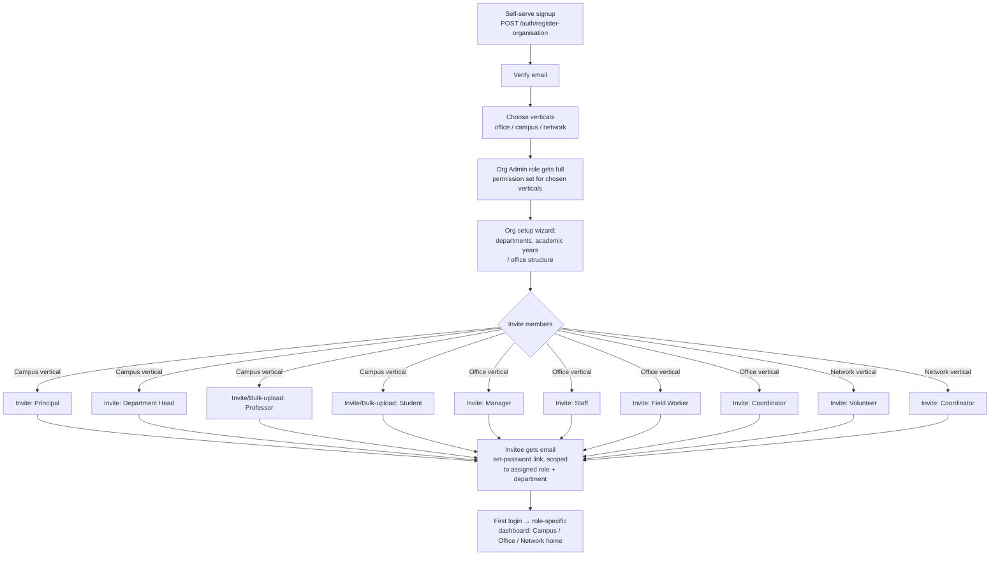

# Doptor Super App — Backlog & Onboarding Flow

Date: 2026-07-03
Scope: Campus + Office verticals, shared platform modules, and the org/user onboarding flow.

This supersedes the module-status findings in `AUDIT_REPORT.md` (2026-06-30) where they
overlap — the codebase has moved on since then (e.g. `files` now implements a real
office e-Dak workflow engine that didn't exist at audit time). Treat this file as the
live backlog; check items off in place and add new ones as they're found.

---

## 1. Onboarding flow (role-based nodes)

### Current state

- `POST /auth/register-organisation` creates an Organisation + a user + an
  **"Organisation Admin"** role, and assigns that role to the user — but assigns
  **zero permissions** to the role (only `database/drizzle/seed.ts`, a dev-only seed
  script, ever grants Org Admin its permissions). A self-serve signup today produces
  an admin who can log in but can't do anything permission-gated.
- There is **no invite flow**. The only way more users end up in an org is:
  - `campus.service.ts` `createFaculty`/`createStudent`/bulk-upload — but these set a
    **fake password hash**, so the created accounts can never log in (see Backlog item C-1).
  - Nothing analogous exists for office roles at all.
- 11 roles are defined in the seed data but have no onboarding path that assigns them
  to a real invited user: Super Admin, Organisation Admin, Department Head, Manager,
  Staff, Field Worker, Professor, Principal, Student, Volunteer, Coordinator.
- `enabled_verticals` / `vertical_config` on the organisation already model
  "which of office / campus / network this org has turned on" — but nothing in
  onboarding actually asks the admin to pick this at signup time.

### Proposed flow

Key design decisions this implies:

- **One generic invite endpoint**, parameterized by role + optional department/class
  assignment, not separate bespoke flows per role. `campus` faculty/student creation
  should become a thin wrapper over this shared invite service instead of hand-rolling
  user creation with a fake password.
- **Role assignment must carry real permissions.** Either extend `registerOrganisation`
  to assign the same default permission set the seed script gives Org Admin, or add
  a `roles.assignDefaultPermissions(roleName)` helper both paths call.
- **Vertical selection at signup** should filter which role options are offered in the
  invite step (no point offering "Professor" to a pure-office org).
- **Invitee state machine**: `invited → password_set → email_verified → active`,
  distinct from today's `email_verified` boolean, so admins can see who hasn't
  completed onboarding yet.

### Backlog: onboarding

- [x] **O-1** ~~Design & implement a generic `POST /users/invite` endpoint~~ — done
      2026-07-03: `POST /users/invite`, `/users/invite/bulk`, `/users/:id/resend-invite`
      (`users.service.ts`/`users.controller.ts`), guarded with `@Permissions("create:users")`,
      sends invite email with a `/accept-invite?token=` link, creates the user in
      `status:'invited'` with an unusable random-bcrypt password until accepted.
- [x] **O-2** ~~Fix `registerOrganisation` permission gap~~ — done 2026-07-03:
      `DEFAULT_PERMISSIONS` extracted to `default-permissions.ts`, seeded per-org and
      linked to the new "Organisation Admin" role inside the existing transaction.
- [x] **O-3** ~~Add invited/active status to `users`~~ — done 2026-07-03: migration
      `0005_ordinary_salo.sql` adds `status`, `invitation_token`, `invitation_expires`,
      `invited_by`. **Still needs to be applied** (`npm run db:migrate` from
      `backend/api`) — not run yet, no local Postgres was available during implementation.
- [ ] **O-4** Build "choose verticals" step into the signup/first-login flow, writing to
      `organisations.enabled_verticals` (currently only settable via raw org update, not
      surfaced in onboarding UI).
- [ ] **O-5** Build a post-signup setup wizard (departments → academic years/office
      structure → invite members) — currently admins land straight on a dashboard with
      no guided setup.
- [x] **O-6** ~~Replace `campus.service.ts` faculty/student creation with the shared
      invite flow~~ — done 2026-07-03: `createFaculty`/`bulkCreateFaculty`/
      `createStudent`/`bulkCreateStudents` now call `UsersService.inviteUser`/
      `bulkInviteUsers` instead of hand-inserting users with placeholder password hashes.
- [ ] **O-7** Role-aware first-login redirect: land Campus roles on `/campus`, Office
      roles on `/office`, Network roles on `/network`, instead of one generic dashboard.

---

## 2. Tracked backlog (from 2026-07-03 module audit)

Legend: 🔴 Critical (broken/insecure today) · 🟠 High (blocks "fully functional" claim) · 🟡 Medium (real gap, not blocking) · 🔵 Nice-to-have

### Critical — fix first

- [x] **C-1** ~~`campus.service.ts:71,91` fake password hash~~ — fixed 2026-07-03 via O-6
      (faculty creation now goes through the real invite flow; no placeholder hashes left).
- [x] **C-2** ~~`campus.service.ts:166` `password_hash: "temp"`~~ — fixed 2026-07-03 via O-6.
- [ ] **C-3** 🔴 `communication.controller.ts:31` — `getConversations` hardcodes
      `const userId = "user-uuid-placeholder"` instead of reading `req.user.id`. Breaks
      the endpoint for every real user despite `@UseGuards(JwtAuthGuard)`. **Unrelated to
      the invite work — still open.**
- [x] **C-4** ~~`registerOrganisation` grants zero permissions~~ — fixed 2026-07-03 via O-2.

### High — required for "fully functional" campus/office

- [ ] **H-1** 🟠 Build campus **results/grades**: no backend tables/endpoints exist at
      all; `app/campus/results/page.tsx` is 100% hardcoded mock data with a fake
      `setTimeout` loading state.
- [ ] **H-2** 🟠 Build/wire campus **timetable**: no dedicated backend model (schedule is
      just a JSON blob per class); `app/campus/timetable/page.tsx` is a dead route
      (`redirect('/campus')`) despite a working `features/campus/TimeTable.tsx`
      component that's never mounted.
- [ ] **H-3** 🟠 Wire **office/admin** page to real data (roles/permissions/departments
      modules already exist) — currently fully hardcoded stats/policies table.
- [ ] **H-4** 🟠 Wire **office/reports** page to real data — currently fully hardcoded,
      no backend report-generation endpoints exist either (only unrelated
      `analytics/overview`).
- [ ] **H-5** 🟠 Wire **office/team** page to real data (reuse `users`/`roles` modules) —
      currently hardcoded fake names ("John Doe", "Jane Smith").
- [ ] **H-6** 🟠 Build **office/registry** — currently an explicit `<ComingSoon>` stub,
      zero implementation either side.
- [ ] **H-7** 🟠 Add real file/attachment upload (multer + storage backend) to
      `documents` and `files` modules — both are metadata-only today, so the e-Dak
      file-movement system can't actually carry an attached document.
- [ ] **H-8** 🟠 Wire **tasks** frontend to the real `tasks` backend module — Kanban UI
      (`features/tasks/TaskKanban.tsx`) runs entirely off `tasks-mock.db.ts`; no
      `services/tasks.service.ts` exists despite the backend having full CRUD +
      assignment + status endpoints ready to use.
- [ ] **H-9** 🟠 Wire **workflows** and **documents** frontends similarly — no
      `services/workflows.service.ts` or `documents.service.ts` exist despite real
      backend CRUD.

### Medium — real gaps, not blocking core flows

- [ ] **M-1** 🟡 `campus.service.ts:461-463` `seedData()` explicitly unimplemented —
      returns `{ message: "Seeding not implemented yet" }`.
- [ ] **M-2** 🟡 `campus.service.ts:62` TODO — organisation_id plumbing for faculty
      creation acknowledged as incomplete.
- [ ] **M-3** 🟡 `analytics.service.ts:24-26` — `activeSessions: 42` and
      `revenue: 45231` are hardcoded mock values, comment admits it. Needs real
      session-count and (if applicable) revenue source, or the fields should be removed
      until backed by real data.
- [ ] **M-4** 🟡 Build a real **notifications** backend — no module/table exists;
      `features/notifications/notifications-mock.db.ts` is entirely self-contained mock.
- [ ] **M-5** 🟡 `features/communication/CommunicationHub.tsx` also has mock-data
      fallbacks layered on top of C-3 — once C-3 is fixed, verify the frontend actually
      calls the real endpoint end-to-end (mock removal + live test).

### Low / cleanup

- [ ] **L-1** 🔵 `frontend/mobile/` has no application code beyond `package.json` — needs
      to be scoped as its own project (not a quick add-on) if mobile is in-scope for
      this milestone.
- [ ] **L-2** 🔵 Reconcile duplicate guard implementations (`src/common/guards/*` vs
      `src/modules/auth/guards/*`) noted in the 2026-06-30 audit — confirm still true and
      consolidate to one.
- [ ] **L-3** 🔵 Reconcile duplicate schema files `audit.schema.ts` /
      `audit-log.schema.ts` if both still exist.
- [ ] **L-4** 🔵 Confirm `features/office/*` vs `features/verticals/office/*` duplicate
      component trees noted in the prior audit are resolved or dead-code one of them.

---

## 3. Suggested sequencing

1. **Critical fixes** (C-1..C-4) — these are security/functionality breaks, not gaps.
   Small, isolated patches; do first regardless of what else is planned.
2. **Onboarding flow** (O-1..O-7) — unblocks getting *any* real user other than the
   founding admin into an organisation correctly. Do before investing further in
   role-specific UI, since it changes how faculty/student/team accounts get created.
3. **High-priority feature completion** (H-1..H-9) — campus results/timetable and
   office admin/reports/team/registry, plus wiring tasks/workflows/documents to their
   already-built backends. These can mostly proceed in parallel once onboarding lands.
4. **Medium/low** — schedule opportunistically alongside the above.
