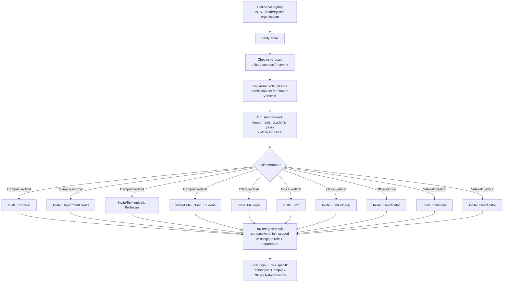

# Doptor Super App — Backlog & Onboarding Flow

Date: 2026-07-03
Scope: Campus + Office verticals, shared platform modules, and the org/user onboarding flow.

This supersedes the module-status findings in `AUDIT_REPORT.md` (2026-06-30) where they
overlap — the codebase has moved on since then (e.g. `files` now implements a real
office e-Dak workflow engine that didn't exist at audit time). Treat this file as the
live backlog; check items off in place and add new ones as they're found.

---

## 0. Campus/Office navigational separation (2026-07-03)

Fixed the data plumbing that was undermining "Campus and Office should feel like
separate products": `VerticalContext.tsx` was hardcoding all 4 verticals as enabled
for every org (real `enabled_verticals` never wired up), and `RoleContext.tsx` was
silently defaulting every user to `'super_admin'` nav (derived from a `user.role`
field that doesn't exist on the real `/auth/me` response). Also fixed: hardcoded
`"Acme Corp"`/`"John Doe"` in Header/Sidebar, clicking the vertical icon rail not
actually navigating anywhere, and `BottomNav` being a fully static tab list.

- [x] Real `enabled_verticals` wired from `organisationService.getById` — verified
      live: a plain member with zero permissions can fetch their own org (no
      `@Permissions` restriction on `GET /organisations/:id`), and the response shape
      matches exactly what `VerticalContext` expects.
- [x] Real role derivation via `AuthContext`'s existing (previously-unused)
      `hasAnyRole` helpers, with a name-mapping shim since DB role names ("Organisation
      Admin", "Professor") don't match the frontend's legacy snake_case enum.
- [x] `activeVertical` now derived from the URL (`usePathname`), not independent
      click-state — fixes drift on deep links/back-forward, and clicking the icon rail
      now actually navigates to `/campus` or `/office`.
- [x] Shared `verticalTheme` token map (`VerticalContext.tsx`) replacing the
      icon-rail-only color constants; applied to `Header`, `VerticalSwitcher`, and new
      `app/campus/layout.tsx` / `app/office/layout.tsx` wrappers.
- [x] `BottomNav` now reuses `Sidebar`'s `verticalMenus` instead of a hardcoded tab list.
- [x] **Recheck round (same day)**: 8-angle review found the icon rail hid disabled
      verticals from the switcher but never stopped a direct/bookmarked URL from fully
      rendering one anyway (`/campus` worked even for an office-only org) — fixed with a
      client-side redirect-to-`/` guard in `VerticalContext.tsx` once `enabledVerticals`
      has actually loaded. Also fixed: a real backend role name not in the hardcoded
      priority list (e.g. a custom/renamed org role) silently downgraded to the same
      `'student'` default as an unauthenticated user — now falls back to `'staff'`
      instead. A third finding (role briefly defaulting to `'student'` during the
      auth-loading window) was investigated and found **not reachable in practice** —
      `AuthGuard.tsx` blocks the whole app shell behind a spinner until loading
      completes, so no user ever sees that state. Production build (`next build`)
      verified clean after fixes.
- [ ] **Not yet done**: migrating existing ad-hoc emerald/indigo Tailwind classes
      scattered across a few campus/office pages onto the shared token system (left
      as-is this pass, flagged for new/touched pages going forward).
- [ ] **Not yet done**: `middleware.ts` still does no real server-side route
      protection (reads a `user_role` cookie nothing sets) — deferred by explicit
      decision, since backend already enforces real permission checks per-endpoint.
      Fixing it properly requires a token-storage strategy change (localStorage →
      cookie) — separate, bigger decision.
- **Verification caveat**: no browser-automation tool (Playwright/chromium-cli) was
  available in this environment, so this was verified via `tsc --noEmit` (clean),
  a live backend check of the one new runtime call (`GET /organisations/:id`, confirmed
  working for zero-permission users), and manual code trace — **not** a real rendered
  click-through. Recommend a manual pass in a browser (or `/run-skill-generator` to
  set up Playwright for this repo) before considering this fully verified.

---

## 1. Onboarding flow (role-based nodes)

### Current state

- `POST /auth/register-organisation` creates an Organisation + a user + an
  **"Organisation Admin"** role, and assigns that role to the user — but assigns
  **zero permissions** to the role (only `database/drizzle/seed.ts`, a dev-only seed
  script, ever grants Org Admin its permissions). A self-serve signup today produces
  an admin who can log in but can't do anything permission-gated.
- There is **no invite flow**. The only way more users end up in an org is:
  - `campus.service.ts` `createFaculty`/`createStudent`/bulk-upload — but these set a
    **fake password hash**, so the created accounts can never log in (see Backlog item C-1).
  - Nothing analogous exists for office roles at all.
- 11 roles are defined in the seed data but have no onboarding path that assigns them
  to a real invited user: Super Admin, Organisation Admin, Department Head, Manager,
  Staff, Field Worker, Professor, Principal, Student, Volunteer, Coordinator.
- `enabled_verticals` / `vertical_config` on the organisation already model
  "which of office / campus / network this org has turned on" — but nothing in
  onboarding actually asks the admin to pick this at signup time.

### Proposed flow

Key design decisions this implies:

- **One generic invite endpoint**, parameterized by role + optional department/class
  assignment, not separate bespoke flows per role. `campus` faculty/student creation
  should become a thin wrapper over this shared invite service instead of hand-rolling
  user creation with a fake password.
- **Role assignment must carry real permissions.** Either extend `registerOrganisation`
  to assign the same default permission set the seed script gives Org Admin, or add
  a `roles.assignDefaultPermissions(roleName)` helper both paths call.
- **Vertical selection at signup** should filter which role options are offered in the
  invite step (no point offering "Professor" to a pure-office org).
- **Invitee state machine**: `invited → password_set → email_verified → active`,
  distinct from today's `email_verified` boolean, so admins can see who hasn't
  completed onboarding yet.

### Backlog: onboarding

- [x] **O-1** ~~Design & implement a generic `POST /users/invite` endpoint~~ — done
      2026-07-03: `POST /users/invite`, `/users/invite/bulk`, `/users/:id/resend-invite`
      (`users.service.ts`/`users.controller.ts`), guarded with `@Permissions("create:users")`,
      sends invite email with a `/accept-invite?token=` link, creates the user in
      `status:'invited'` with an unusable random-bcrypt password until accepted.
- [x] **O-2** ~~Fix `registerOrganisation` permission gap~~ — done 2026-07-03:
      `DEFAULT_PERMISSIONS` extracted to `default-permissions.ts`, seeded per-org and
      linked to the new "Organisation Admin" role inside the existing transaction.
- [x] **O-3** ~~Add invited/active status to `users`~~ — done 2026-07-03: migration
      `0005_ordinary_salo.sql` adds `status`, `invitation_token`, `invitation_expires`,
      `invited_by`. **Applied and verified end-to-end** 2026-07-03 (register-org →
      invite → accept-invite → login round trip, plus cross-org IDOR/hijack edge cases,
      all confirmed against a live local Postgres).
- [ ] **O-4** Build "choose verticals" step into the signup/first-login flow, writing to
      `organisations.enabled_verticals` (currently only settable via raw org update, not
      surfaced in onboarding UI).
- [ ] **O-5** Build a post-signup setup wizard (departments → academic years/office
      structure → invite members) — currently admins land straight on a dashboard with
      no guided setup.
- [x] **O-6** ~~Replace `campus.service.ts` faculty/student creation with the shared
      invite flow~~ — done 2026-07-03: `createFaculty`/`bulkCreateFaculty`/
      `createStudent`/`bulkCreateStudents` now call `UsersService.inviteUser`/
      `bulkInviteUsers` instead of hand-inserting users with placeholder password hashes.
- [ ] **O-7** Role-aware first-login redirect: land Campus roles on `/campus`, Office
      roles on `/office`, Network roles on `/network`, instead of one generic dashboard.

---

## 2. Tracked backlog (from 2026-07-03 module audit)

Legend: 🔴 Critical (broken/insecure today) · 🟠 High (blocks "fully functional" claim) · 🟡 Medium (real gap, not blocking) · 🔵 Nice-to-have

### Critical — fix first

- [x] **C-1** ~~`campus.service.ts:71,91` fake password hash~~ — fixed 2026-07-03 via O-6
      (faculty creation now goes through the real invite flow; no placeholder hashes left).
- [x] **C-2** ~~`campus.service.ts:166` `password_hash: "temp"`~~ — fixed 2026-07-03 via O-6.
- [x] **C-3** ~~`communication.controller.ts:31` hardcoded placeholder userId~~ — fixed
      2026-07-03: `getConversations` now reads `req.user.id`. Note: the WebSocket gateway
      (`communication.gateway.ts`) still has no socket authentication at all — `handleConnection`
      has a bare "Authentication logic here" comment, and `sendMessage` trusts a
      client-supplied `payload.userId` rather than an authenticated identity, so any
      connected client can send messages as any user. Tracked as new item **M-6** below,
      out of scope for this fix (real-time auth is a bigger design decision).
- [x] **C-4** ~~`registerOrganisation` grants zero permissions~~ — fixed 2026-07-03 via O-2.
- [x] **C-5** ~~`registerOrganisation` audit-log/token-generation ran inside the DB
      transaction using the untransacted `this.db` handle~~ — found + fixed 2026-07-03
      while doing end-to-end verification: `createAuditLog`/`generateTokens` (inserts
      into `audit_logs`/`refresh_tokens`) ran *inside* `db.transaction(async (tx) => ...)`
      but via `this.db` instead of `tx`, so they referenced a user row not yet committed
      and always threw an FK-violation 500. `auth.service.ts` now returns
      `{newUser, newOrg}` from the transaction and runs those side effects after it
      commits. Pre-existing bug, unrelated to the invite work, but blocked verifying it.
- [x] **C-6** ~~`JwtModule.register()` read `process.env.JWT_SECRET` before
      `ConfigModule` loaded `.env`~~ — found + fixed 2026-07-03: `AuthModule`'s
      `JwtModule.register({secret: process.env.JWT_SECRET})` is evaluated at import time
      (before `AppModule`'s `ConfigModule.forRoot()` runs), so it always silently signed
      tokens with the hardcoded fallback secret, while `JwtStrategy` (instantiated later,
      at DI-resolution time) verified against the real `.env` value — every authenticated
      request 401'd. Only masked in production because docker-compose injects
      `JWT_SECRET` as a real OS env var before Node starts. Fixed by switching to
      `JwtModule.registerAsync()` + `ConfigService`, matching `DatabaseModule`'s existing
      pattern. Pre-existing, unrelated to the invite work, but silently broke all local
      dev auth until now.

### Newly found + fixed 2026-07-03, round 2 (recheck of H-3/H-5/H-6)

- [x] **C-9** ~~`GET /files/registry` had no authorization guard~~ — fixed: any
      authenticated org member (regardless of role/permissions) could read every file
      in the org, including `security_level: confidential/secret` ones, since
      `FilesController`'s class-level `RolesGuard` is a no-op without an explicit
      `@Roles()`/`@Permissions()` on the handler. Gated behind
      `@Permissions("read:documents")` (reusing the closest existing permission
      resource — a dedicated `files` permission resource doesn't exist yet, tracked as
      **M-7** below). Verified: org admin gets 200, a freshly invited member with no
      role assigned gets a clean 403.
- [x] **C-10** ~~`files.organisation_id` migration would fail against any database with
      existing `files` rows~~ — fixed: the auto-generated migration added the column as
      `NOT NULL` with no default/backfill. This project's actual deploy process runs
      `drizzle-kit push:pg` directly against the live schema (see `docs/DEPLOYMENT.md`),
      not the versioned SQL files, so a `NOT NULL` add would prompt/fail against a
      populated `files` table. Made the column nullable at the schema level instead
      (`files.schema.ts`) — the service layer always sets it on every insert, so it's
      required in practice without risking a broken deploy. Migration `0007` reflects
      the correction.
- [x] **C-11** ~~Non-deterministic "which role" a multi-role user shows as~~ — fixed:
      `users.service.ts findAll`'s role-lookup query had no `ORDER BY`, so which role
      won the dedup for a user with 2+ roles was unspecified per Postgres, causing the
      office/team and office/admin "Admins" stat to flap between runs on identical data.
      Now ordered by `userRoles.created_at` (earliest-assigned role wins, deterministic).
- [x] Consolidated three independently-defined "safe user columns" constants
      (`files.service.ts`, `campus.service.ts`, `communication.service.ts` each had their
      own slightly-different version) into one shared
      `backend/api/src/common/constants/safe-user-columns.ts` — multiple review passes
      flagged the duplication as a drift risk (a future sensitive column added to `users`
      would need updating in 3+ places to stay leak-free).
- [x] Fixed a redundant double-fetch in `office/admin/page.tsx` (fetched the full org
      user list twice — once unfiltered, once for `status=invited` — to derive two
      counts); now fetches once and derives both client-side, matching the pattern
      already used correctly on the team page. Also removed an unused `ArrowRight` import
      left over from the old mocked page.
- [ ] **M-7** 🟡 No dedicated `files` permission resource exists in
      `DEFAULT_PERMISSIONS` — the new registry guard (C-9) reuses `read:documents` as
      the closest fit. A real e-Dak-specific permission set (e.g. `files:read`,
      `files:approve`) would let file-level access be tuned independently of the
      generic `documents` module.
- [ ] **M-8** 🟡 `GET /files/registry` has no pagination (`db.query.files.findMany`
      with no `.limit()`) — a new, unbounded-result-set endpoint. Fine at current scale,
      but will need `limit`/`offset` or cursor pagination before an org accumulates
      thousands of files.
- [ ] **M-9** 🟡 `files.service.ts getRegistry`'s `search` param uses raw `like()`
      against user input — Postgres `LIKE` wildcard characters (`%`, `_`) in a search
      term aren't escaped, so a search containing a literal `_` can match more broadly
      than intended. Minor UX correctness issue, not a security risk.

### High — required for "fully functional" campus/office

- [ ] **H-1** 🟠 Build campus **results/grades**: no backend tables/endpoints exist at
      all; `app/campus/results/page.tsx` is 100% hardcoded mock data with a fake
      `setTimeout` loading state.
- [ ] **H-2** 🟠 Build/wire campus **timetable**: no dedicated backend model (schedule is
      just a JSON blob per class); `app/campus/timetable/page.tsx` is a dead route
      (`redirect('/campus')`) despite a working `features/campus/TimeTable.tsx`
      component that's never mounted.
- [x] **H-3** ~~Wire office/admin page to real data~~ — done 2026-07-03: stats
      (departments, roles, members, pending invites) and a Roles & Permissions table are
      now real, sourced from `departmentService`/`roleService`/`usersService`. The
      fictional "policies" concept had no backing schema anywhere — replaced entirely
      rather than left half-mocked; a real policy engine (if wanted) is new scope, not
      tracked here yet.
- [ ] **H-4** 🟠 Wire **office/reports** page to real data — currently fully hardcoded,
      no backend report-generation endpoints exist either (only unrelated
      `analytics/overview`).
- [x] **H-5** ~~Wire office/team page to real data~~ — done 2026-07-03: roster now comes
      from `usersService.list({organisationId})` (extended backend `findAll` to join
      department + primary role), stats computed from real data, resend-invite wired
      into each pending row.
- [x] **H-6** ~~Build office/registry~~ — done 2026-07-03: interpreted as an
      organisation-wide searchable ledger of every file (e-Dak) across departments,
      consistent with the already-built `files` e-Dak system. Added `organisation_id` to
      the `files` table (was missing — files had no direct tenant scoping at all, only
      reachable indirectly via `initiator_id → users.organisation_id`), a new
      `GET /files/registry` endpoint, and a real frontend page with search/status
      filtering. Verified end-to-end (create file → appears in registry, org-scoped).
- [ ] **H-7** 🟠 Add real file/attachment upload (multer + storage backend) to
      `documents` and `files` modules — both are metadata-only today, so the e-Dak
      file-movement system can't actually carry an attached document.
- [ ] **H-8** 🟠 Wire **tasks** frontend to the real `tasks` backend module — Kanban UI
      (`features/tasks/TaskKanban.tsx`) runs entirely off `tasks-mock.db.ts`; no
      `services/tasks.service.ts` exists despite the backend having full CRUD +
      assignment + status endpoints ready to use.
- [ ] **H-9** 🟠 Wire **workflows** and **documents** frontends similarly — no
      `services/workflows.service.ts` or `documents.service.ts` exist despite real
      backend CRUD.

### Newly found + fixed 2026-07-03 (while building H-3/H-5/H-6)

- [x] **C-7** ~~`req.user.userId` vs `req.user.id` mismatch~~ — fixed: `JwtStrategy`
      only ever returns `id` (no `userId` key), but `campus.controller.ts` and
      `files.controller.ts` read `req.user.userId` throughout, so every one of those
      handlers (`getMyClasses`, `markAttendance`, `files/inbox`, `files/:id/forward`,
      etc.) always received `undefined` — silently broken end-to-end for as long as
      those modules have existed. Mechanically replaced across both files.
- [x] **C-8** ~~Password hashes and auth tokens leaked in API responses~~ — fixed:
      several relational queries used Drizzle's `with: { relation: true }` shorthand
      (or queried `users` directly with no column restriction), which returns **every**
      column including `password_hash`, `invitation_token`, `password_reset_token`, etc.
      Found live while testing the new file registry endpoint. Fixed in
      `files.service.ts` (`initiator`/`currentHolder`/`fromUser`/`toUser`/note `user`
      relations), `campus.service.ts` (`getFacultyList`/`getFaculty`/`getStudentList`/
      `getStudent` — direct `users` queries, plus the `student` relation in attendance
      views), and `communication.service.ts` (`sender` relation) — all now scoped to a
      public-safe column set. This was live in production for campus faculty/student
      list endpoints before this fix.

### Medium — real gaps, not blocking core flows

- [ ] **M-1** 🟡 `campus.service.ts:461-463` `seedData()` explicitly unimplemented —
      returns `{ message: "Seeding not implemented yet" }`.
- [ ] **M-2** 🟡 `campus.service.ts:62` TODO — organisation_id plumbing for faculty
      creation acknowledged as incomplete.
- [ ] **M-3** 🟡 `analytics.service.ts:24-26` — `activeSessions: 42` and
      `revenue: 45231` are hardcoded mock values, comment admits it. Needs real
      session-count and (if applicable) revenue source, or the fields should be removed
      until backed by real data.
- [ ] **M-4** 🟡 Build a real **notifications** backend — no module/table exists;
      `features/notifications/notifications-mock.db.ts` is entirely self-contained mock.
- [ ] **M-5** 🟡 `features/communication/CommunicationHub.tsx` also has mock-data
      fallbacks layered on top of C-3 — now that C-3 is fixed, verify the frontend
      actually calls the real endpoint end-to-end (mock removal + live test).
- [ ] **M-6** 🟡 `communication.gateway.ts` has no WebSocket authentication —
      `handleConnection` never verifies the socket's identity, and `sendMessage` trusts a
      client-supplied `payload.userId` instead of one derived from an authenticated
      session, so any connected client can send messages impersonating any user.

### Low / cleanup

- [ ] **L-1** 🔵 `frontend/mobile/` has no application code beyond `package.json` — needs
      to be scoped as its own project (not a quick add-on) if mobile is in-scope for
      this milestone.
- [ ] **L-2** 🔵 Reconcile duplicate guard implementations (`src/common/guards/*` vs
      `src/modules/auth/guards/*`) noted in the 2026-06-30 audit — confirm still true and
      consolidate to one.
- [ ] **L-3** 🔵 Reconcile duplicate schema files `audit.schema.ts` /
      `audit-log.schema.ts` if both still exist.
- [ ] **L-4** 🔵 Confirm `features/office/*` vs `features/verticals/office/*` duplicate
      component trees noted in the prior audit are resolved or dead-code one of them.

---

## 3. Suggested sequencing

1. **Critical fixes** (C-1..C-4) — these are security/functionality breaks, not gaps.
   Small, isolated patches; do first regardless of what else is planned.
2. **Onboarding flow** (O-1..O-7) — unblocks getting *any* real user other than the
   founding admin into an organisation correctly. Do before investing further in
   role-specific UI, since it changes how faculty/student/team accounts get created.
3. **High-priority feature completion** (H-1..H-9) — campus results/timetable and
   office admin/reports/team/registry, plus wiring tasks/workflows/documents to their
   already-built backends. These can mostly proceed in parallel once onboarding lands.
4. **Medium/low** — schedule opportunistically alongside the above.
