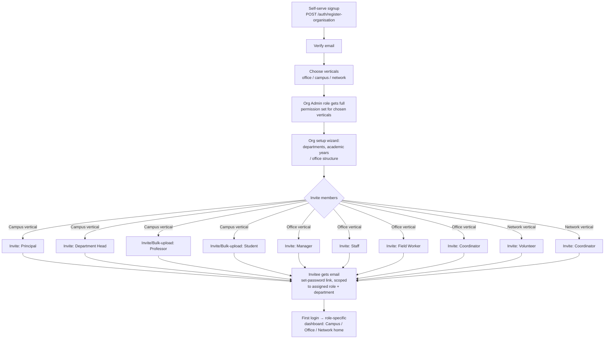

# Doptor Super App — Backlog & Onboarding Flow

Date: 2026-07-03
Scope: Campus + Office verticals, shared platform modules, and the org/user onboarding flow.

This supersedes the module-status findings in `AUDIT_REPORT.md` (2026-06-30) where they
overlap — the codebase has moved on since then (e.g. `files` now implements a real
office e-Dak workflow engine that didn't exist at audit time). Treat this file as the
live backlog; check items off in place and add new ones as they're found.

---

## 0. Campus/Office navigational separation (2026-07-03)

Fixed the data plumbing that was undermining "Campus and Office should feel like
separate products": `VerticalContext.tsx` was hardcoding all 4 verticals as enabled
for every org (real `enabled_verticals` never wired up), and `RoleContext.tsx` was
silently defaulting every user to `'super_admin'` nav (derived from a `user.role`
field that doesn't exist on the real `/auth/me` response). Also fixed: hardcoded
`"Acme Corp"`/`"John Doe"` in Header/Sidebar, clicking the vertical icon rail not
actually navigating anywhere, and `BottomNav` being a fully static tab list.

- [x] Real `enabled_verticals` wired from `organisationService.getById` — verified
      live: a plain member with zero permissions can fetch their own org (no
      `@Permissions` restriction on `GET /organisations/:id`), and the response shape
      matches exactly what `VerticalContext` expects.
- [x] Real role derivation via `AuthContext`'s existing (previously-unused)
      `hasAnyRole` helpers, with a name-mapping shim since DB role names ("Organisation
      Admin", "Professor") don't match the frontend's legacy snake_case enum.
- [x] `activeVertical` now derived from the URL (`usePathname`), not independent
      click-state — fixes drift on deep links/back-forward, and clicking the icon rail
      now actually navigates to `/campus` or `/office`.
- [x] Shared `verticalTheme` token map (`VerticalContext.tsx`) replacing the
      icon-rail-only color constants; applied to `Header`, `VerticalSwitcher`, and new
      `app/campus/layout.tsx` / `app/office/layout.tsx` wrappers.
- [x] `BottomNav` now reuses `Sidebar`'s `verticalMenus` instead of a hardcoded tab list.
- [x] **Recheck round (same day)**: 8-angle review found the icon rail hid disabled
      verticals from the switcher but never stopped a direct/bookmarked URL from fully
      rendering one anyway (`/campus` worked even for an office-only org) — fixed with a
      client-side redirect-to-`/` guard in `VerticalContext.tsx` once `enabledVerticals`
      has actually loaded. Also fixed: a real backend role name not in the hardcoded
      priority list (e.g. a custom/renamed org role) silently downgraded to the same
      `'student'` default as an unauthenticated user — now falls back to `'staff'`
      instead. A third finding (role briefly defaulting to `'student'` during the
      auth-loading window) was investigated and found **not reachable in practice** —
      `AuthGuard.tsx` blocks the whole app shell behind a spinner until loading
      completes, so no user ever sees that state. Production build (`next build`)
      verified clean after fixes.
- [x] ~~Migrate the ad-hoc emerald/indigo Tailwind classes onto the shared token
      system~~ — done 2026-08-03, but **not as written**. The item assumed those two
      colours were stray vertical accents. Reading all ~334 call sites showed they
      were not: outside `verticalTheme` they were never vertical at all.
      `features/office/` used emerald in **seven** files, none of them about Campus —
      it meant *approved / present / active / valid / done*, paired with red for the
      negative half. `TaskKanban` used it for the "Done" column, `NotificationCenter`
      for `file_approved`/`leave_approved`. Indigo meant *primary action* — the filled
      button, the active tab, the focus ring — and is not `primary` (violet), which is
      the product chrome. Putting either on the vertical accent map would have made
      every "Approved" badge change colour with the active vertical.
      So they moved onto two **semantic** ramps instead — `success` and `brand` in
      `tailwind.config.ts`, declared as exact hex copies of Tailwind's emerald and
      indigo. That made the whole change a pure rename with a **provably empty visual
      diff**: renaming `success`→`emerald` and `brand`→`indigo` in the compiled
      stylesheet reproduces the pre-migration one exactly, 964 rules for 964, nothing
      added and nothing lost. Re-theming is now those two blocks rather than 37 files.
      **171 references across 37 files. ~165 stay raw on purpose**, because forcing
      them into a semantic name would be a lie:
      - **Token definitions.** `verticalTheme` (`contexts/VerticalContext.tsx`) and
        `TONES` (`features/dashboard/DashboardPrimitives.tsx`) *are* the token layer.
        Raw values are what a token definition is made of.
      - **Decorative colour.** Stat-tile swatches, avatar-initial chips, the Holiday
        marker, timetable cards, and the join/create accents on `/onboarding` and
        `/register`. `tone="emerald"` sits on "Departments", "Total Tasks" and
        "Roles"; `tone="indigo"` on "Pending Leave". None of that is state.
      - **Domain colour.** The "Initial Green Sheet Note" field in `FileCreateModal`
        is green because a green sheet is green.
      Guarded by `e2e/design-tokens.spec.ts` (static, no server): every `success-*`/
      `brand-*` shade must be declared — Tailwind emits nothing for a class it does
      not know and neither `tsc` nor the build says a word — and raw emerald/indigo
      is **ratcheted**, not banned, so a new status badge reaching for the palette
      fails while a decorative chip moving does not. Both were verified to fail by
      injecting each regression before being kept.
      **Deliberately still raw and out of scope:** `red`+`rose` (196 uses) are two
      families for one *danger* meaning, `orange`+`amber` (111) two for *warning*,
      and `blue` (131) is *info*. Collapsing those duplicate pairs moves real pixels
      and wants its own pass — the scope here was emerald/indigo only.
- [x] ~~`middleware.ts` does no real server-side route protection~~ — done 2026-07-27.
      The token-storage change this was waiting on is made: the API issues httpOnly
      access/refresh cookies (`common/config/auth-cookies.ts`) and `JwtStrategy` accepts
      the cookie *or* the Bearer header, so non-browser callers are unaffected.
      `middleware.ts` is restored and gates unauthenticated requests server-side — but
      only when `COOKIE_AUTH_ENABLED` is set, since the cookie is invisible to it unless
      the API also sets `COOKIE_DOMAIN` to the parent domain. Set both together.
      **Both are now set on dev** (2026-07-28, `.dev.doptor.in` / `1`) and the gating is
      verified live — protected routes 307 to `/login?next=…` without a valid cookie.
      See `docs/DEPLOYMENT.md` §6; they are **not** in git, so any rebuilt environment
      needs them added by hand.
      It decodes rather than verifies (verifying would duplicate `JWT_SECRET` into the web
      container) and gates auth only, not roles (the payload carries none, and baking them
      in would delay role changes until token refresh). The API remains the boundary.
      **Closed 2026-07-28** — see **S-1** below.

- [x] **S-1** 🔴 ~~Auth tokens readable from JavaScript~~ — fixed 2026-07-28. From
      2026-07-27 the API issued both tokens as httpOnly cookies, but the web app kept
      storing copies in `localStorage` for the Bearer fallback, so the XSS exposure the
      cookies were introduced to close **stayed wide open for a day**. This app renders
      user-supplied names, document titles and task text; an injected script could read a
      **7-day refresh token** straight out of storage — demonstrated, not theorised: the
      new `e2e/token-storage.spec.ts` was run against the deployment before the fix and
      dumped both tokens out of `localStorage` in its failure output.
      The web app is now cookie-only. What that forced:
      - **`isAuthenticated()` is gone.** It read `localStorage` synchronously, which is
        exactly the readable credential being removed. `AuthContext` asks
        `GET /auth/me` on boot; a 401 is the ordinary signed-out case, not an error.
      - **The "no stored token, don't bother refreshing" guard is gone**, because the
        client can no longer tell a signed-out visitor from an expired access token.
        Both take one refresh attempt. It cannot loop: `/auth/refresh` is in
        `AUTH_ENDPOINTS`, so its own 401 returns before triggering another refresh.
      - **The refresh call now needs explicit `withCredentials`.** It uses bare `axios`
        (so a 401 can't recurse through the interceptor), and the bare instance does
        *not* inherit the setting — previously it passed the token in the body, so this
        was invisible.
      **The Bearer header is deliberately still accepted server-side.** Dropping it would
      break the smoke suites, curl and the mobile app for no gain, since a caller that can
      set headers was never the threat. Only the *browser* stopped using it.
      **Constraint to remember:** the cookies are `SameSite=Lax`, so this depends on the
      API being same-site with the web app. Moving the API to an unrelated registrable
      domain would break authentication outright and needs `SameSite=None` plus a CSRF
      review — not a Bearer fallback bolted back on.
- **Verification caveat**: no browser-automation tool (Playwright/chromium-cli) was
  available in this environment, so this was verified via `tsc --noEmit` (clean),
  a live backend check of the one new runtime call (`GET /organisations/:id`, confirmed
  working for zero-permission users), and manual code trace — **not** a real rendered
  click-through. Recommend a manual pass in a browser (or `/run-skill-generator` to
  set up Playwright for this repo) before considering this fully verified.

---

## 1. Onboarding flow (role-based nodes)

### Current state

- `POST /auth/register-organisation` creates an Organisation + a user + an
  **"Organisation Admin"** role, and assigns that role to the user — but assigns
  **zero permissions** to the role (only `database/drizzle/seed.ts`, a dev-only seed
  script, ever grants Org Admin its permissions). A self-serve signup today produces
  an admin who can log in but can't do anything permission-gated.
- There is **no invite flow**. The only way more users end up in an org is:
  - `campus.service.ts` `createFaculty`/`createStudent`/bulk-upload — but these set a
    **fake password hash**, so the created accounts can never log in (see Backlog item C-1).
  - Nothing analogous exists for office roles at all.
- 11 roles are defined in the seed data but have no onboarding path that assigns them
  to a real invited user: Super Admin, Organisation Admin, Department Head, Manager,
  Staff, Field Worker, Professor, Principal, Student, Volunteer, Coordinator.
- `enabled_verticals` / `vertical_config` on the organisation already model
  "which of office / campus / network this org has turned on" — but nothing in
  onboarding actually asks the admin to pick this at signup time.

### Proposed flow

```mermaid
flowchart TD
    A[Self-serve signup\nPOST /auth/register-organisation] --> B[Verify email]
    B --> C[Choose verticals\noffice / campus / network]
    C --> D[Org Admin role gets full\npermission set for chosen verticals]
    D --> E[Org setup wizard:\ndepartments, academic years\n/ office structure]
    E --> F{Invite members}

    F -->|Campus vertical| G1[Invite: Principal]
    F -->|Campus vertical| G2[Invite: Department Head]
    F -->|Campus vertical| G3[Invite/Bulk-upload: Professor]
    F -->|Campus vertical| G4[Invite/Bulk-upload: Student]

    F -->|Office vertical| H1[Invite: Manager]
    F -->|Office vertical| H2[Invite: Staff]
    F -->|Office vertical| H3[Invite: Field Worker]
    F -->|Office vertical| H4[Invite: Coordinator]

    F -->|Network vertical| I1[Invite: Volunteer]
    F -->|Network vertical| I2[Invite: Coordinator]

    G1 & G2 & G3 & G4 & H1 & H2 & H3 & H4 & I1 & I2 --> J[Invitee gets email\nset-password link, scoped\nto assigned role + department]
    J --> K[First login → role-specific\ndashboard: Campus / Office / Network home]
```

Key design decisions this implies:

- **One generic invite endpoint**, parameterized by role + optional department/class
  assignment, not separate bespoke flows per role. `campus` faculty/student creation
  should become a thin wrapper over this shared invite service instead of hand-rolling
  user creation with a fake password.
- **Role assignment must carry real permissions.** Either extend `registerOrganisation`
  to assign the same default permission set the seed script gives Org Admin, or add
  a `roles.assignDefaultPermissions(roleName)` helper both paths call.
- **Vertical selection at signup** should filter which role options are offered in the
  invite step (no point offering "Professor" to a pure-office org).
- **Invitee state machine**: `invited → password_set → email_verified → active`,
  distinct from today's `email_verified` boolean, so admins can see who hasn't
  completed onboarding yet.

### Backlog: onboarding

- [x] **O-1** ~~Design & implement a generic `POST /users/invite` endpoint~~ — done
      2026-07-03: `POST /users/invite`, `/users/invite/bulk`, `/users/:id/resend-invite`
      (`users.service.ts`/`users.controller.ts`), guarded with `@Permissions("create:users")`,
      sends invite email with a `/accept-invite?token=` link, creates the user in
      `status:'invited'` with an unusable random-bcrypt password until accepted.
- [x] **O-2** ~~Fix `registerOrganisation` permission gap~~ — done 2026-07-03:
      `DEFAULT_PERMISSIONS` extracted to `default-permissions.ts`, seeded per-org and
      linked to the new "Organisation Admin" role inside the existing transaction.
- [x] **O-3** ~~Add invited/active status to `users`~~ — done 2026-07-03: migration
      `0005_ordinary_salo.sql` adds `status`, `invitation_token`, `invitation_expires`,
      `invited_by`. **Applied and verified end-to-end** 2026-07-03 (register-org →
      invite → accept-invite → login round trip, plus cross-org IDOR/hijack edge cases,
      all confirmed against a live local Postgres).
- [x] **O-4** ~~Build "choose verticals" step into the signup/first-login flow~~ — **was
      already built**; this entry was stale. `app/register/page.tsx` has had a working
      office/campus/network picker that posts `enabled_verticals`, and
      `register-organisation.dto.ts` accepts it. Verified live 2026-07-27: registering with
      `['office','campus']` stores exactly that on the organisation, and `VerticalContext`
      reads it back. No code change needed.
- [x] **O-5** ~~Build a post-signup setup wizard~~ — done 2026-07-27 as a **state-derived
      setup checklist** (`features/dashboard/SetupChecklist.tsx`) on the Org Admin
      dashboard, rather than a blocking multi-step wizard.
      Each step is derived from a real count in `/analytics/overview`
      (`totalDepartments`, `totalUsers`, `totalTasks`) instead of a stored
      `setup_completed` flag. That means no migration and no new persistence, it cannot
      claim a step is done when it isn't, a step correctly reopens if the org deletes its
      only department, and there is nothing to "skip" — a skippable wizard is a stored flag
      again. The card unmounts once every step passes, so established orgs never see it.
      Departments come first because task creation requires a `department_id`, so it is a
      real dependency rather than a preference. The contract it relies on is asserted in
      `07-dashboard-access.smoke.js`.
- [x] **O-6** ~~Replace `campus.service.ts` faculty/student creation with the shared
      invite flow~~ — done 2026-07-03: `createFaculty`/`bulkCreateFaculty`/
      `createStudent`/`bulkCreateStudents` now call `UsersService.inviteUser`/
      `bulkInviteUsers` instead of hand-inserting users with placeholder password hashes.
- [x] **O-7** ~~Role-aware first-login redirect~~ — **goal met by a different design;
      the redirect was deliberately not built.** The stated purpose was to stop users
      landing on "one generic dashboard". As of 2026-07-27 `/` is no longer generic: it
      dispatches on both role *and* the org's enabled verticals, so an Office admin, an
      Office staff member and a Campus student each get a different real dashboard there.
      Redirecting Office roles to `/office` would now be a **downgrade** — `/office` is
      `FileDashboard`, the e-file pillar view, which is narrower than the role dashboard.
      Revisit only if per-vertical landing pages gain their own org-level overviews.

---

## 2. Tracked backlog (from 2026-07-03 module audit)

Legend: 🔴 Critical (broken/insecure today) · 🟠 High (blocks "fully functional" claim) · 🟡 Medium (real gap, not blocking) · 🔵 Nice-to-have

### Critical — fix first

- [ ] **C-15** 🔴 **The `campus` module has the same defect class as C-11 and C-13.**
      Found **2026-08-03** while fixing C-13, and **verified by live exploit, not by
      inspection**. The HTTP surface was closed the same day by unregistering
      `CampusModule` from `app.module.ts`; **the defects below are still in the code**
      and this item stays open until they are fixed. Do not re-register the module
      first — `06-tenancy.smoke.js` asserts the routes 404 and will go red.
      - `campus.controller.ts` carries `@UseGuards(JwtAuthGuard, RolesGuard)` and **not
        one handler declares `@Roles`**. `RolesGuard` returns `true` when no roles are
        declared, so every route was authentication-only — the same illusion of cover
        that made C-13 survive the 2026-07-27 sweep.
      - **Ungated destructive deletes.** `deleteFaculty`/`deleteStudent` are
        `db.delete(users).where(eq(users.id, id))` on a bare id, and `deleteCourse` the
        same shape; the controller passes no organisation. Measured: a **Staff** user in
        org B hard deleted a user row in org A (`DELETE /campus/faculty/:id` → 200).
        `updateClass` and `enrollStudent` are unscoped writes of the same shape.
      - **Organisation taken from the request instead of the JWT.**
        `GET /campus/academic-years` reads `organisation_id` from the **query string**;
        `createAcademicYear` passes the body through and honours `data.organisation_id`.
        Measured: org B read org A's academic years (200) and created a row inside org A
        (201). That write also runs `UPDATE academic_years SET is_current=false WHERE
        organisation_id=<caller-supplied>`, so it can clear the victim's current year.
      - **Attendance is unscoped entirely.** `getClassAttendance` filters on `class_id`
        alone, `getAttendanceReport` on dates alone. `markAttendance` looks the class up
        by faculty and then **ignores the result** — the `ForbiddenException` is commented
        out with "Assuming strict Check. Can relax for admins if needed."
      - **No guard anywhere reads `enabled_verticals`.** Measured: an office-only tenant
        that never bought Campus could call `/campus/students` (200). Campus being
        "disabled" was a frontend navigation decision only.
      Already correct, and not part of this item: exams, results, faculty/student *reads*,
      courses, departments and `getAllClasses` are org-scoped (the 2026-07-24 pass).
      When Campus returns, fix it the way C-13 was fixed — a `findInOrg` chokepoint for
      every by-id operation, `organisation_id` removed from the DTOs and the query param
      so it can only come from `req.user`, `PermissionsGuard` at class level, and a campus
      block in `06-tenancy.smoke.js` that replaces the tripwire with real probes.
      **No tenant was harmed by the removal — verified on dev, not assumed (2026-08-03).**
      Unregistering the module 404s `/campus/*` for anyone genuinely using it, so this was
      queried rather than reasoned about. 34 organisations carry `campus` in
      `enabled_verticals`; **all 34 are test fixtures and all 34 have zero campus data** —
      one user each, every one a `@verify.test` address, and `0` across students/faculty,
      courses, academic years and exams. The slugs say the same thing
      (`e2e-vertcampus-*`, `e2e-offcampus-*`, `e2e-railonly-*`, `e2e-vertrefuse-*`, plus
      suite 01's `fin-org-*`), and all were created 27–31 July, the window the suites were
      being run in. Not one organisation ever created a course, a year, an exam or a single
      student. The vertical was ticked at signup by a fixture and never used.
      Incidentally confirmed in the same result: several of those rows still carry
      `"network"`, deleted under **M-18** on 2026-07-28. That is exactly the case
      `SHIPPABLE_VERTICALS` in `contexts/VerticalContext.tsx` exists to absorb — a vertical
      the build no longer knows about, still sitting in an organisation's row. The
      mitigation was needed and is working.
- [x] **C-13** 🔴 ~~The e-Dak `files` module had no tenant scoping and almost no
      permission gating~~ — found and fixed **2026-08-03**, during a full end-to-end audit.
      **Verified by live exploit before the fix, not by inspection.**
      This is the same defect class as **C-11**, in the module that *is* the Office
      product, and it survived that 2026-07-27 sweep untouched.
      - `findOne`, `forwardFile`, `returnFile`, `approveFile`, `rejectFile`, `closeFile`
        and `addNote` all looked the row up by bare id (`where: eq(files.id, id)`), and
        `files.controller.ts` passed **no `organisation_id` at all** to any of them.
      - The class carried `@UseGuards(JwtAuthGuard, RolesGuard)` and only
        `registry`/`analytics` named a permission. `RolesGuard` returns `true` when a
        handler declares no `@Roles` — and none did — so **13 of 15 routes were
        authentication-only**. The guard being present is what made this look covered.
      - Measured against the pre-fix build via the new checks in
        `06-tenancy.smoke.js`: org B's *Organisation Admin* could read org A's file
        (200), and forward / return / approve / reject / close / annotate it (all 201).
        The victim file's status really did change to `closed` and its note sheet really
        did go from 1 note to 2 — the calls committed, they did not merely return 2xx.
      - **Custody could also leave the tenant in the other direction**: `toUserId` was
        never checked, so a file could be forwarded to a user in another organisation.
        Scoping the file alone would not have closed this; `assertUserInOrg` does.
      Fixed by routing every single-file operation through the `findFileInOrg`
      chokepoint that already existed in the same file (and was used only by the three
      attachment paths), adding `assertUserInOrg` for every custody hand-off, and moving
      `PermissionsGuard` to class level so an ungated route is now a deliberate choice.
      `inbox`/`outbox` stay ungated on purpose — they return only the caller's own files,
      the same reasoning that leaves `GET /tasks/my-tasks` open (**M-11**).
      `sync-permissions.ts` gained step **4b**: `forward:files`/`approve:files` have no
      `documents` counterpart, so step 4 could never reach them and older roles would
      have silently lost the ability to move or approve a file.
      **Regression suite:** `06-tenancy.smoke.js` now covers files — 8 cross-tenant
      probes, 2 state assertions, the outbound-custody check, and **2 positive controls**
      (owner can still read and annotate), because a suite that 404s everything would
      otherwise pass against a module that refused everyone.
- [x] **C-14** 🔴 ~~Stored XSS on the e-file note sheet~~ — found and fixed **2026-08-03**,
      while fixing C-13; the two share a code path. `NoteSheetEditor.tsx:138` rendered
      every note body through `dangerouslySetInnerHTML`, and **nothing sanitises note
      content anywhere in the stack** — not the API, not the client. Notes are authored in
      a plain `<textarea>`, so the HTML path bought nothing and cost this.
      Any note author could store script that ran for every colleague who later opened
      the file; chained with C-13 it ran for every colleague **in any organisation**.
      The auth cookies are httpOnly so no token was readable, but the script executed
      same-origin with those cookies attached and could do whatever the viewer could.
      Now rendered as text with `whitespace-pre-wrap` for the line breaks that were the
      only thing the HTML path was really providing.
      **Related, same commit:** the Bold/Italic/List/Align toolbar above that textarea had
      **no `onClick` on any of its four buttons** — and it is what made notes look like
      rich text, which is what makes rendering them as HTML look reasonable. The fake
      toolbar and the XSS were one mistake seen from two ends. A `Share` button on
      `FileActionPanel` was dead in the same way. Both removed per **M-17**.
- [x] **C-1** ~~`campus.service.ts:71,91` fake password hash~~ — fixed 2026-07-03 via O-6
      (faculty creation now goes through the real invite flow; no placeholder hashes left).
- [x] **C-2** ~~`campus.service.ts:166` `password_hash: "temp"`~~ — fixed 2026-07-03 via O-6.
- [x] **C-3** ~~`communication.controller.ts:31` hardcoded placeholder userId~~ — fixed
      2026-07-03: `getConversations` now reads `req.user.id`. Note: the WebSocket gateway
      (`communication.gateway.ts`) still has no socket authentication at all — `handleConnection`
      has a bare "Authentication logic here" comment, and `sendMessage` trusts a
      client-supplied `payload.userId` rather than an authenticated identity, so any
      connected client can send messages as any user. Tracked as new item **M-6** below,
      out of scope for this fix (real-time auth is a bigger design decision).
- [x] **C-4** ~~`registerOrganisation` grants zero permissions~~ — fixed 2026-07-03 via O-2.
- [x] **C-5** ~~`registerOrganisation` audit-log/token-generation ran inside the DB
      transaction using the untransacted `this.db` handle~~ — found + fixed 2026-07-03
      while doing end-to-end verification: `createAuditLog`/`generateTokens` (inserts
      into `audit_logs`/`refresh_tokens`) ran *inside* `db.transaction(async (tx) => ...)`
      but via `this.db` instead of `tx`, so they referenced a user row not yet committed
      and always threw an FK-violation 500. `auth.service.ts` now returns
      `{newUser, newOrg}` from the transaction and runs those side effects after it
      commits. Pre-existing bug, unrelated to the invite work, but blocked verifying it.
- [x] **C-6** ~~`JwtModule.register()` read `process.env.JWT_SECRET` before
      `ConfigModule` loaded `.env`~~ — found + fixed 2026-07-03: `AuthModule`'s
      `JwtModule.register({secret: process.env.JWT_SECRET})` is evaluated at import time
      (before `AppModule`'s `ConfigModule.forRoot()` runs), so it always silently signed
      tokens with the hardcoded fallback secret, while `JwtStrategy` (instantiated later,
      at DI-resolution time) verified against the real `.env` value — every authenticated
      request 401'd. Only masked in production because docker-compose injects
      `JWT_SECRET` as a real OS env var before Node starts. Fixed by switching to
      `JwtModule.registerAsync()` + `ConfigService`, matching `DatabaseModule`'s existing
      pattern. Pre-existing, unrelated to the invite work, but silently broke all local
      dev auth until now.

### Newly found + fixed 2026-07-03, round 2 (recheck of H-3/H-5/H-6)

- [x] **C-9** ~~`GET /files/registry` had no authorization guard~~ — fixed: any
      authenticated org member (regardless of role/permissions) could read every file
      in the org, including `security_level: confidential/secret` ones, since
      `FilesController`'s class-level `RolesGuard` is a no-op without an explicit
      `@Roles()`/`@Permissions()` on the handler. Gated behind
      `@Permissions("read:documents")` (reusing the closest existing permission
      resource — a dedicated `files` permission resource doesn't exist yet, tracked as
      **M-7** below). Verified: org admin gets 200, a freshly invited member with no
      role assigned gets a clean 403.
- [x] **C-10** ~~`files.organisation_id` migration would fail against any database with
      existing `files` rows~~ — fixed: the auto-generated migration added the column as
      `NOT NULL` with no default/backfill. This project's actual deploy process runs
      `drizzle-kit push:pg` directly against the live schema (see `docs/DEPLOYMENT.md`),
      not the versioned SQL files, so a `NOT NULL` add would prompt/fail against a
      populated `files` table. Made the column nullable at the schema level instead
      (`files.schema.ts`) — the service layer always sets it on every insert, so it's
      required in practice without risking a broken deploy. Migration `0007` reflects
      the correction.
- [x] **C-11** ~~Non-deterministic "which role" a multi-role user shows as~~ — fixed:
      `users.service.ts findAll`'s role-lookup query had no `ORDER BY`, so which role
      won the dedup for a user with 2+ roles was unspecified per Postgres, causing the
      office/team and office/admin "Admins" stat to flap between runs on identical data.
      Now ordered by `userRoles.created_at` (earliest-assigned role wins, deterministic).
- [x] Consolidated three independently-defined "safe user columns" constants
      (`files.service.ts`, `campus.service.ts`, `communication.service.ts` each had their
      own slightly-different version) into one shared
      `backend/api/src/common/constants/safe-user-columns.ts` — multiple review passes
      flagged the duplication as a drift risk (a future sensitive column added to `users`
      would need updating in 3+ places to stay leak-free).
- [x] Fixed a redundant double-fetch in `office/admin/page.tsx` (fetched the full org
      user list twice — once unfiltered, once for `status=invited` — to derive two
      counts); now fetches once and derives both client-side, matching the pattern
      already used correctly on the team page. Also removed an unused `ArrowRight` import
      left over from the old mocked page.
- [x] **M-7** ~~No dedicated `files` permission resource~~ — done 2026-07-24 (Office
      roadmap Phase 1): added a `files` resource to `DEFAULT_PERMISSIONS`
      (create/read/update/delete/forward/approve); `/files/registry` and
      `/files/analytics` now guard on `read:files` instead of borrowing
      `read:documents`.
      **Required a backfill** — `permissions` rows are per-org and only created at org
      registration, so a new resource simply doesn't exist for already-registered orgs
      and the guard would have 403'd everyone. New idempotent
      `src/database/drizzle/sync-permissions.ts` (`pnpm --filter api db:sync-permissions`)
      inserts missing rows per org and grants `<action>:files` to any role that already
      held the matching `<action>:documents`, preserving existing access exactly.
      **Must be run once against each environment before/with this deploy.**
- [x] **M-8** ~~`GET /files/registry` has no pagination~~ — done 2026-07-24: `page`/`limit`
      query params (default 25, max 100), returning
      `{ data, total, page, limit, totalPages }` instead of a bare array. Count and page
      query run concurrently. **Breaking response-shape change** — `frontend/web` updated.
      The registry page's stat tiles previously counted the loaded array, which would have
      silently become per-page counts; they now come from `GET /files/analytics`, which is
      org-wide and already existed.
- [x] **M-9** ~~`getRegistry` search uses raw `like()`~~ — done 2026-07-24: user input is
      escaped for `%`, `_` and `\` before interpolation, and the search switched from
      `like` to `ilike` so the registry search box is case-insensitive (it was
      case-sensitive, which is not what a search box should do).

### High — required for "fully functional" campus/office

- [x] **H-1** ~~Build campus results/grades~~ — done 2026-07-03: new `exams` and
      `exam_grades` tables (org-scoped), `POST/GET /campus/exams`,
      `POST /campus/exams/:id/grades` (bulk, upsert-per-student), `POST
      /campus/exams/:id/publish`, `GET /campus/results/summary` (per-exam
      average/pass-rate computed server-side + org-wide summary counts).
      `app/campus/results/page.tsx` now fetches real data, no more mock/setTimeout.
      Verified end-to-end live: create exam → submit grades → average/pass-rate compute
      correctly → publish → summary counts update correctly.
      **Found while testing, not fixed (separate, deeper pre-existing bug, new item
      M-10 below)**: the frontend's "Create Class" dialog calls `POST /campus/classes`,
      which doesn't exist on the backend at all (404) — that flow has never worked.
- [x] **H-2** ~~Wire campus timetable~~ — done 2026-07-03: replaced the dead
      `redirect('/campus')` route with a real page that fetches `GET /campus/classes`
      and renders the existing (previously unmounted) `features/campus/TimeTable.tsx`
      component. While building this, found and fixed a **broad cross-tenant data leak**
      spanning most of the campus module's read endpoints — `getFacultyList`,
      `getFaculty`, `getStudentList`, `getStudent`, `getCourses`, `getDepartments`, and
      `getAllClasses` (classes specifically) had no organisation scoping at all, so any
      authenticated user of any org could see every other org's faculty/student PII,
      courses, and departments. All now scoped from `req.user.organisation_id`, verified
      live with two separate orgs (Org B correctly sees zero of Org A's data). Also fixed
      `createCourse`/`createDepartment` missing `.returning()` (silently returned empty
      responses) while touching the same methods.
- [x] **H-3** ~~Wire office/admin page to real data~~ — done 2026-07-03: stats
      (departments, roles, members, pending invites) and a Roles & Permissions table are
      now real, sourced from `departmentService`/`roleService`/`usersService`. The
      fictional "policies" concept had no backing schema anywhere — replaced entirely
      rather than left half-mocked; a real policy engine (if wanted) is new scope, not
      tracked here yet.
- [x] **H-4** ~~Wire office/reports page to real data~~ — done 2026-07-03: the
      "report generation" concept had no backing schema anywhere (same situation as
      H-3's fake "policies"), so replaced it with real file analytics rather than a
      fabricated report list — new `GET /files/analytics` (org-scoped, same
      `@Permissions("read:documents")` guard as the registry) returning status/category/
      priority breakdowns and average age of open files, computed server-side from real
      `files` rows. Verified live: created 2 files with different categories/priorities,
      confirmed the breakdown counts came back correct.
- [x] **H-5** ~~Wire office/team page to real data~~ — done 2026-07-03: roster now comes
      from `usersService.list({organisationId})` (extended backend `findAll` to join
      department + primary role), stats computed from real data, resend-invite wired
      into each pending row.
- [x] **H-6** ~~Build office/registry~~ — done 2026-07-03: interpreted as an
      organisation-wide searchable ledger of every file (e-Dak) across departments,
      consistent with the already-built `files` e-Dak system. Added `organisation_id` to
      the `files` table (was missing — files had no direct tenant scoping at all, only
      reachable indirectly via `initiator_id → users.organisation_id`), a new
      `GET /files/registry` endpoint, and a real frontend page with search/status
      filtering. Verified end-to-end (create file → appears in registry, org-scoped).
- [x] **H-7** ~~Add real file/attachment upload to `documents` and `files`~~ — **this
      entry was stale**; verified done 2026-07-28. Both modules use multer:
      `files.controller.ts` has `POST /files/:id/attachments`, `GET /files/:id/attachments`
      and `GET /files/attachments/:attachmentId/download`, and `documents.controller.ts`
      gained upload + download in Phase 5. The e-Dak system does carry real attachments.
- [x] **H-8** ~~Wire tasks frontend to the real tasks backend~~ — done in two steps.
      2026-07-06: `services/tasks.service.ts` created, `tasks-mock.db.ts` deleted, Kanban
      wired to real CRUD. 2026-07-24 (Office roadmap Phase 2d): rebuilt against the deeper
      task model — board cards show reference (`FIN-12`), labels, multi-assignee avatars,
      subtask/comment counts; new `TaskDetailDrawer.tsx` provides inline title/description
      edit, status/priority/due-date, assignee add-remove, label toggle, comments, and the
      audit history timeline. Also deleted `TaskList.tsx` and `TaskDetail.tsx`, which were
      hardcoded-mock components never imported anywhere (`TaskDetail` is superseded by the
      new drawer). A real List/Table view is still outstanding — see roadmap Phase 2.
- [x] **H-9** ~~Wire workflows & documents frontends~~ — done 2026-07-27 (Office roadmap
      Phase 5). **Documents:** built `services/documents.service.ts` and a real
      `DocumentExplorer` (replacing a 136-line hardcoded mock) — link + file upload,
      download, search/status filter, and a draft → pending_review → approved/rejected
      approval lifecycle. Backend was metadata-only with the same body-supplied tenancy
      holes as departments (M-13 class); now org-scoped, permission-gated, migration `0015`.
      **Workflows:** decided against a generic jsonb engine — document approval is the
      concrete workflow, gated by the existing `workflows:approve`. The workflows module is
      hardened (org-scoped + gated) but intentionally has no UI. Verified live (16 checks).

### Newly found + fixed 2026-07-03 (while building H-3/H-5/H-6)

- [x] **C-7** ~~`req.user.userId` vs `req.user.id` mismatch~~ — fixed: `JwtStrategy`
      only ever returns `id` (no `userId` key), but `campus.controller.ts` and
      `files.controller.ts` read `req.user.userId` throughout, so every one of those
      handlers (`getMyClasses`, `markAttendance`, `files/inbox`, `files/:id/forward`,
      etc.) always received `undefined` — silently broken end-to-end for as long as
      those modules have existed. Mechanically replaced across both files.
- [x] **C-8** ~~Password hashes and auth tokens leaked in API responses~~ — fixed:
      several relational queries used Drizzle's `with: { relation: true }` shorthand
      (or queried `users` directly with no column restriction), which returns **every**
      column including `password_hash`, `invitation_token`, `password_reset_token`, etc.
      Found live while testing the new file registry endpoint. Fixed in
      `files.service.ts` (`initiator`/`currentHolder`/`fromUser`/`toUser`/note `user`
      relations), `campus.service.ts` (`getFacultyList`/`getFaculty`/`getStudentList`/
      `getStudent` — direct `users` queries, plus the `student` relation in attendance
      views), and `communication.service.ts` (`sender` relation) — all now scoped to a
      public-safe column set. This was live in production for campus faculty/student
      list endpoints before this fix.

### Medium — real gaps, not blocking core flows

- [ ] **M-1** 🟡 `campus.service.ts:461-463` `seedData()` explicitly unimplemented —
      returns `{ message: "Seeding not implemented yet" }`.
- [ ] **M-2** 🟡 `campus.service.ts:62` TODO — organisation_id plumbing for faculty
      creation acknowledged as incomplete.
- [x] **M-3** ~~`analytics.service.ts` returns invented figures~~ — fixed 2026-07-27
      alongside C-11: `activeSessions: 42` and `revenue: 45231` are gone, replaced with
      real org-scoped counts (users, files, tasks/open, documents/pending, departments,
      currently-checked-in, pending leave). Revenue has no backing model, so it is not
      reported rather than fabricated. Original note: `analytics.service.ts:24-26` — `activeSessions: 42` and
      `revenue: 45231` are hardcoded mock values, comment admits it. Needs real
      session-count and (if applicable) revenue source, or the fields should be removed
      until backed by real data.
- [x] **M-4** ~~Build a real notifications backend~~ — done 2026-07-25 (Office roadmap
      Phase 3). Org-scoped `notifications` table (migration `0013`), full API (list /
      unread-count / mark-read / mark-all-read), producers wired from tasks
      (assigned, commented) and files (forwarded, approved, rejected), and a live
      `NotificationBell` in the app header. Verified end-to-end against a live DB (15
      checks). If a `notifications-mock.db.ts` still exists in the frontend, it is now
      dead — the bell uses the real `notifications.service.ts`.
- [x] **M-5** ~~`CommunicationHub` has mock-data fallbacks~~ — **closed 2026-07-28 by
      removal. Chat is not a feature being given.** It was worse than this entry recorded:
      `CURRENT_USER_ID = "user-uuid-placeholder"` was hardcoded and message history was
      never fetched (the effect body was a comment), so the UI was non-functional rather
      than merely mock-flavoured — while being linked in the sidebar for every role.
      `app/communication/` and `features/communication/` are deleted, all five sidebar
      entries removed, and `CommunicationModule` is **unregistered from `app.module.ts`**
      so the WebSocket gateway no longer listens. The module, service and gateway files
      remain in the tree unwired; re-registering brings chat back.
      The `conversations`/`messages` tables are **left in place** — dropping them needs a
      migration and is destructive, and they are empty. Note the gateway was security-
      hardened in M-6 (handshake JWT verified, membership checks, CORS locked down), so
      what is being retired is sound code for a product decision, not a liability.

- [x] **M-6** ⚪ ~~`communication.gateway.ts` has no WebSocket authentication.~~ —
      **resolved by deletion 2026-07-30** (commit `7bf693b`), the outcome recommended when this
      was reclassified on 2026-07-29 from "security gap" to "dead code to delete".
      The defect was real: `handleConnection` never verified the socket's identity and
      `sendMessage` trusted a client-supplied `payload.userId`, so any connected client could
      impersonate any user. It was never exposed — `CommunicationModule` had been unregistered
      from `app.module.ts` when the product went Office-only, so the gateway never instantiated.
      The whole `modules/communication/` tree is now gone, which is what closes this for good:
      there is no longer a module anyone can re-register to reopen the hole. If chat ever
      returns, port the tracker's gateway-auth-in-middleware approach rather than reviving this.
      **Tail:** the `communication` DB schema and its (empty) `conversations`/`messages` tables
      are still in place — inert and now unreferenced by any module; drop them separately.
- [ ] **M-10** 🟡 Found 2026-07-03 while testing H-1: `POST /campus/classes` doesn't
      exist on the backend at all (404) despite the frontend's `CreateClassDialog.tsx`
      calling it — "Create Class" has never worked. Also the dialog only collects
      `name`/`departmentId`, but `academic_classes` requires `course_id` and
      `faculty_id` (both NOT NULL) — the form needs those fields added before a working
      endpoint can even be wired up correctly.
      *(Campus is frozen as of 2026-07-24 — see `docs/OFFICE-ROADMAP.md`. Not being worked.)*
- [x] **M-11** ~~Tasks endpoints had no RBAC~~ — done 2026-07-24 (Office roadmap Phase 1):
      `tasks.controller.ts` was `@UseGuards(JwtAuthGuard)` only, so any authenticated org
      member could update or delete any task in their org. Now gated with
      `create/read/update/delete/assign:tasks`. `GET /tasks/my-tasks` is deliberately left
      ungated — it only ever returns tasks already assigned to the caller in their own org,
      and gating it would stop a user seeing their own work.
      **Note:** `tasks` permission *rows* already existed for every org, but were only
      *granted* to `Organisation Admin`/`Super Admin`, so gating alone would have cut off
      every other role. `db:sync-permissions` (see M-7) grants `tasks` permissions to all
      existing roles, preserving today's effective access; admins can tighten per-role
      afterwards from the Roles & Permissions UI.
- [x] **M-13** 🔴 ~~`departments` module had no tenant scoping~~ — found and fixed
      2026-07-24 while verifying Phase 2 against a live database. Same class of
      cross-tenant leak as the campus one fixed in `5a7394a`:
      `POST /departments` took `organisation_id` from the **request body**, so any
      authenticated user could create a department inside any other organisation;
      `GET /departments` took an **optional** org query param and returned every
      organisation's departments when it was omitted; and `GET/PATCH/DELETE
      /departments/:id` had **no org check at all**, so any user could read, rename or
      delete any other org's department by id. All five now scope from
      `req.user.organisation_id`, `organisation_id` is gone from the DTO, and
      `@Permissions` gates were added. Cross-org access returns 404, not 403, so ids
      aren't probeable. Verified live with two orgs.
- [x] **M-14** 🟠 ~~Same-second token issuance returned a 500~~ — found and fixed
      2026-07-24. `generateTokens` signed the refresh token from `{ sub, email }` only;
      JWT `iat`/`exp` are second-granular, so two refresh tokens minted for one user in
      the same second were byte-identical and collided with the UNIQUE constraint on
      `refresh_tokens.token`. Reachable in normal use — register-then-login, a
      double-clicked login button, or any two logins in the same second. Refresh tokens
      now carry a random `jti`; the access token payload is unchanged.
- [x] **M-12** ~~`attendance` schema column-name mismatch~~ — done 2026-07-24: the Drizzle
      property was `s_present: boolean("is_present")`, so the TS property name didn't match
      the DB column. Renamed the property to `is_present`. No source referenced the old
      name (only stale `dist/` build output), so nothing else needed changing. Cleared
      ahead of Office roadmap Phase 4, which builds HR attendance on this table.

- [x] **M-15** ~~`/admin` has no `page.tsx`~~ — done 2026-07-28, and the diagnosis in the
      original entry was wrong twice over. `middleware.ts` never mentioned `/admin` (it
      uses a blanket matcher); the prefetch 404s came from the sidebar's `Link`s. More
      importantly this was **not** cosmetic: `RoleGuard` redirects a denied user to
      `findVerticalRoot(pathname)`, which for any `/admin/*` route is `/admin` — so the
      denial path for the entire admin area landed on the 404. Fixed by building a real
      `/admin` landing page (org-scoped counts from `/analytics/overview`).
      Two adjacent bugs had to be fixed with it, or the obvious repair would have made
      things worse:
      - `isRouteAllowed` returned `true` for any `pathname === root`, so `/admin` itself
        was **ungated** — a landing page alone would have shown the admin hub to every
        signed-in staff member. The shortcut is removed; `/campus`, `/office` and
        `/network` stay open because no rule names them exactly, which is asserted.
      - Dropping `/admin` from `VERTICAL_ROOTS` (the tidier-looking fix) would have
        **opened every `/admin/*` route to everyone** client-side, since `isRouteAllowed`
        returns `true` outside those prefixes. It stays in the list, now documented.
      - Gating `/admin` then made `RoleGuard`'s fallback an infinite loop (deny at
        `/admin/roles` → redirect to `/admin` → deny → redirect…), so the fallback now
        checks the target is allowed before using it. It also gained the missing `role`
        dependency, without which a role change never re-evaluated.
      Covered by 35 assertions against the compiled `route-access.ts`.

- [x] **M-16** ~~All three `/admin/*` pages were fabricated~~ — found and fixed 2026-07-28.
      `/admin/roles` reported `Total Roles 12`, `Active Users 156`, `Permissions 48` and
      five invented roles including a "Project Lead" with 109 users — while a real
      organisation gets exactly six roles at registration. `/admin/departments` invented
      departments, heads ("Amit Sharma") and **budgets**; `/admin/settings` reported
      "System Status: Healthy", "Active Modules: 14", "Integrations: 5". None of these
      pages made a single API call.
      All three now read the real services, which already existed — no backend work was
      needed. Columns with no backing model are **dropped rather than wired**, following
      H-3/H-4: department budget and sub-units, and the roles `type`/`status` columns,
      have no schema behind them and cannot be anything but invented.
      Creating a department is wired because the onboarding `SetupChecklist` links a new
      org straight to that page, so a read-only page would dead-end onboarding.
      Renaming the organisation is wired (`PATCH /organisations/:id`, org-scoped since
      C-11). Slug and vertical toggles are deliberately read-only — the slug is a lookup
      key, and flipping a vertical changes navigation for every member.
      Guarded by new smoke suite `09-admin-access.smoke.js` (25 checks), which asserts
      the field *shapes* the pages render, not just reachability.

- [x] **M-17** ~~`ReadyUI` renders chrome that lies~~ — fixed 2026-07-28. The shell for
      **15 pages** drew a search box that only toasted "Search engine is initializing...",
      an Export button **no page has ever passed a handler for**, a "More options" button
      that toasted "restricted in preview", clickable stat tiles toasting "synchronization
      in progress", and a footer claiming "Real-time Link Active" with no socket anywhere.
      Seven pages also shipped a primary action with no handler ("Add Faculty", "Create
      Campaign", "Launch Initiative") that toasted "feature is coming soon!".
      The rule now: **a control is driven by a handler prop and is not drawn without one.**
      `primaryAction.onClick` is required, which turned those seven into type errors rather
      than something to find by reading; they are on frozen or unreachable pages, so the
      buttons were removed rather than wired.
      One control survived by being made real: `/office/registry` calls itself a
      "searchable ledger" and `GET /files/registry` has taken a `search` param since M-8
      (made case-insensitive and escaped in M-9) — none of it reachable. Now wired, with a
      reset to page 1 so a search with matches can't land on an empty page 4.
      Covered by `e2e/page-shell.spec.ts`.

- [x] **M-21** 🔴 ~~Cold-loading `/office` or `/campus` redirected to the dashboard~~ —
      found and fixed 2026-07-28 while browser-testing M-17. **A fresh load of any URL in
      the Office vertical — the primary product — bounced to `/`.** Bookmarks, refreshes,
      deep links, new tabs.
      `VerticalProvider` treated "AuthContext hasn't resolved yet" as "this organisation
      has no verticals": on mount `user` is null, so it set `enabledVerticals = ['core']`
      *and cleared its loading flag*, which unblocked its own redirect effect before the
      real answer arrived. Clicking through from `/` always worked, because by then the
      provider had resolved — which is exactly why it survived unnoticed.
      Invisible to the smoke suites, invisible to `tsc`, and missed by the existing e2e
      specs because they all happened to target ungated routes. Regression coverage in
      `e2e/vertical-routing.spec.ts`, every case using a **cold** `page.goto`.

- [x] **M-18** ~~The Network vertical has no backend at all~~ — **closed 2026-07-28 by
      deletion.** It was 363 lines of hardcoded UI with no `network` backend module, no
      schema tables, and headline metrics like "Lives Impacted" and "Badges Issued" —
      while being offered on the signup form as a product ("Volunteer management,
      Campaigns"). Three of its seven pages were honest `ComingSoon` placeholders; the
      other four invented everything.
      Deleted rather than kept inert because **nothing was half-built, so nothing was
      lost**: there was no foundation to continue from, git history preserves it exactly,
      and if Network is ever built it should be designed against real requirements rather
      than resurrected from a mockup. Removed: `app/network/`, the sidebar block, the
      `network` theme tokens, the `VerticalType` member, the `/network` route-access
      entries, and the signup option.
      `SHIPPABLE_VERTICALS` in `VerticalContext.tsx` still filters the value, because
      organisations that selected it keep `"network"` in their `enabled_verticals` row.
      Covered by `e2e/unshipped-surfaces.spec.ts`, which asserts a **404** — deletion, not
      the redirect it used to get.

- [x] **M-19** ~~`/approvals` was fabricated and linked in the Office sidebar~~ — fixed
      2026-07-28. It hardcoded "Pending Approvals 42", "Approved Today 128", "Avg.
      Decision Time 4.2h" and five invented requests with invented people, while being
      linked in the sidebar for **three roles** — the most-reachable fabricated page in
      the product. The real data already existed and `ManagerDashboard` already surfaced
      it in miniature; this page had simply never been wired.
      Now a real approvals centre over two queues — documents in `pending_review` and
      leave requests in `pending` — with inline approve/reject. Each queue is gated on
      the permission that backs it (`approve:workflows`, `approve:attendance`) rather
      than on role, for the same reason as `ManagerDashboard`: Manager and Department
      Head collapse to one legacy role but only one of them can approve.
      "Approved Today" and "Avg. Decision Time" are **not** reproduced — they need a
      decision-history aggregate no endpoint offers, so they are absent rather than
      estimated. Row shapes are pinned in suites `04` and `05` (+6 checks), because a
      dropped `with:` relation would blank the rows silently instead of erroring.

- [x] **M-23** 🟡 ~~**`/analytics` is a fabricated, orphaned page that fetches a hardcoded
      `http://localhost:3000` URL.**~~ Found 2026-07-30 while auditing UI/UX; **pre-existing,
      not from the tasks/attendance batch.** Four separate problems, all in
      `features/analytics/AnalyticsDashboard.tsx`:
      **(1)** line 24 is `await fetch('http://localhost:3000/analytics/overview')` — an
      absolute localhost URL in shipped client code, so on any real deployment the *visitor's
      browser* calls **its own** `localhost:3000`. It resolves to nothing, every value falls
      back to `0`, and the comment above it (`// In production, use env variable for base URL`)
      records that this was known and left.
      **(2)** It expects `revenue`, `totalMessages` and `activeSessions`, **none of which the
      API has ever returned.** `GET /analytics/overview` really returns `totalUsers`,
      `totalFiles`, `totalTasks`, `openTasks`, `totalDocuments`, `documentsPendingReview`,
      `totalDepartments`, `currentlyCheckedIn`, `pendingLeaveRequests` — verified live. So the
      component was written against an API that never existed. "Total Revenue" has no meaning
      in an office suite, and "Total Messages" refers to chat, **deleted** under Office-only.
      **(3)** The rest is inline fabrication: trend badges hardcoded `+20.1% / +15.2% / +5.4%
      / +2.3%`, a "Revenue Growth" chart with invented bar heights, and traffic sources
      "Direct 45% / Social Media 25%".
      **(4)** It fails `cold-load.spec.ts` **consistently against a production build (2/2),
      while passing in `next dev`** — `waitForLoadState('networkidle')` times out. The visible
      network activity is just the one 404 above; the stall itself is not fully root-caused.
      **Note it is linked from no navigation** — reachable only by typing the URL, which is why
      nobody has reported it, and why it also **evaded the fabricated-data sweep**: that greps
      for `const UPPER_CASE = [...]` arrays and this page's fake values are inline JSX
      literals. Exactly the evasion recorded in `PORTING-GAPS.md` § G-4.
      **Recommendation: delete it**, consistent with how Network and the fabricated approvals
      components were handled. If analytics is wanted, rewrite against the real nine-field
      endpoint using the existing `services/analytics.service.ts`, which already goes through
      `apiClient` correctly and is what `/admin` uses for its real counts. **Do not merely fix
      the URL** — that would render a page of zeroes and invented percentages.

      **Closed 2026-07-31 by rebuild, not deletion.** The rebuild happened in two steps, and
      the first one is the part worth keeping:
      - `1eb094c` (2026-07-30) removed the localhost URL, the three imaginary fields and every
        invented percentage, wiring the page to `analyticsService.getOverview()`. That fixed
        **(1)**, **(2)** and **(3)**.
      - It also **reintroduced a smaller version of the same defect**, which is why this entry
        stayed open a day longer: a "System Status" card whose four green lights were the
        literal `active={true}`, asserting health nothing had measured — the same thing M-16
        deleted from `/admin/settings`. And because it hand-rolled its own tile markup instead
        of using `DashboardPrimitives`, it fell back to `0` on a failed request, so a broken
        page was indistinguishable from a brand-new organisation. That primitive's own comment
        warns against exactly this: *"showing '0' before the data arrives reads as real data
        and is the failure mode this whole change exists to remove."*
      - **2026-07-31:** rebuilt on `useAsync` + `StatTile`/`ErrorNote`, so all nine counts show,
        a failure renders the error instead of zeroes, and dark-mode AA comes from primitives
        already proven at AA. The status card is gone; the reason it is gone is recorded in the
        component, because "add a system status panel" is an obvious-looking idea.
      - **(4) is fixed and verified against a production build** — `/analytics stays put` in
        `cold-load.spec.ts` passes, where it previously failed 2/2. The `networkidle` stall went
        with the 404 that caused it.
      - **No longer orphaned:** a sidebar entry for `super_admin`/`org_admin` (`Sidebar.tsx`),
        and `/analytics` added to `dark-mode-contrast.spec.ts`, since a route in the nav is one
        worth guarding.
      - **Guarded by `e2e/analytics.spec.ts`** (3 specs): tiles must match counts fetched
        independently from the API, the status-panel strings must be absent, and a stubbed 500
        must render an error with **no** tile showing a number. Each was verified by
        reintroducing its own bug and watching only that spec go red — the zero-fallback and
        the status panel were each restored, rebuilt and re-run.

- [ ] **M-20** 🟡 `/campus/faculty` and `/campus/students` are fabricated ("Dr. Sarah
      Connor", "Publications 1,240", "2,840 students", "Aarav Sharma") **despite
      `GET /campus/faculty` and `GET /campus/students` existing, being org-scoped since
      H-2, and `campusService.getFacultyList()`/`getStudentList()` already being written.**
      This is roughly two hours of wiring, not a build.
      **Parked as of 2026-07-28: Campus is disabled entirely** (see M-22), so these pages
      are unreachable and the fabricated data is not user-visible. Do this at the same
      time as re-enabling Campus, not before.

- [x] **M-22** ~~Campus is still offered while only Office is being sold~~ — done
      2026-07-28. Campus is **disabled, deliberately not deleted**: removed from
      `SHIPPABLE_VERTICALS` and from the signup picker, so its routes redirect and no new
      organisation can choose it.
      The distinction from M-18 is the whole point. Network was a mockup — deleting it
      cost nothing. **Campus is real**: an org-scoped backend, exams and results, the
      timetable, its own migrations, and a cross-tenant leak already fixed in H-2.
      Deleting it would have thrown away shipped, security-hardened work. Every page,
      endpoint, service method and test stays exactly where it is.
      **Re-enabling is adding `'campus'` back to one array** and restoring the signup
      option. `e2e/unshipped-surfaces.spec.ts` asserts campus routes **redirect rather
      than 404**, which is what would catch someone "cleaning up" by deleting it.

- [x] **C-11** 🔴 ~~Cross-tenant privilege escalation in roles/users/organisations~~ —
      found and fixed 2026-07-27 during a full security review, **verified by live
      exploit**. The platform's own access-control modules were the least protected in
      the codebase: `roles`, `permissions`, `users`, `organisations` and `analytics` all
      carried only `JwtAuthGuard`, looked rows up by bare id, and accepted
      `organisation_id` from the request body. As a Staff user this chain worked:
      create a role (ungated) → **inside another organisation** (body org id) → grant it
      all 46 permissions (`POST /roles/:id/permissions` was ungated) → self-assign →
      **12 → 46 permissions**; and separately, **strip permissions from another tenant's
      Organisation Admin** (tenant denial-of-service). Also: `GET /users` had an
      *optional* org filter so omitting it returned every tenant's PII;
      `PATCH`/`DELETE /users/:id` and `/organisations/:id` were unscoped (any user could
      edit or **delete any organisation**); analytics counted rows across all tenants.
      All now org-scoped from `req.user.organisation_id` and permission-gated, with
      `organisation_id` removed from the create DTOs. Kept as a permanent regression
      suite: `backend/api/test/smoke/06-tenancy.smoke.js`.
- [x] **C-12** 🔴 ~~JWT_SECRET fell back to a public placeholder~~ — fixed 2026-07-27.
      Signer and verifier both defaulted to `"your-secret-key-change-in-production"`, so
      a deploy missing `JWT_SECRET` would boot and look healthy while **anyone knowing
      that public string could forge a token for any user in any org**. The app now
      refuses to start if the secret is missing, empty, or still the placeholder
      (`common/config/jwt-secret.ts`). Verified: boots with the real value, refuses both
      bad cases.
- [x] **M-6** ~~`communication.gateway.ts` has no WebSocket authentication~~ — fixed
      2026-07-27. Was worse than recorded: `handleConnection` had only an
      "Authentication logic here" comment and `cors: "*"`, so anyone could connect from
      any site; `joinRoom` took any conversation id with no membership check (read any
      org's messages by enumeration); `sendMessage` trusted `payload.userId`
      (**impersonate any user**). Now the handshake JWT is verified and the socket
      dropped if invalid, the sender comes from the verified token, both join and send
      require conversation membership, and CORS is restricted to `FRONTEND_URL`.

### Low / cleanup

- [x] **L-1** ~~`frontend/mobile/` has no application code beyond `package.json`~~ —
      **closed by decision, 2026-08-03: mobile ships as a PWA, not a native app.** The
      question this entry asked ("scope it as its own project if mobile is in scope") is
      answered — there is no native project to scope. `frontend/web` *is* the mobile
      target.
      **Built the same day.** `app/manifest.ts`, `public/sw.js`, an `/offline` fallback,
      a generated icon set, and the `metadata`/`viewport` exports the app had never had —
      it shipped with **no title and no favicon**, so every tab and bookmark showed the
      bare URL.
      **The service worker caches nothing user-specific, and that is the design.** Cache
      Storage is keyed by origin, not by user, and signing out clears cookies rather than
      caches — so a worker that cached a file registry would hand one tenant's data to the
      next person on a shared device. That would be a fourth cross-tenant read after C-11,
      C-13 and C-15, and the only one with no server-side fix available, because no request
      would reach the server to be refused. Cross-origin (the API) is returned before any
      caching decision, non-GET is never touched, navigations are network-only with the
      offline page as fallback, and the single runtime `cache.put` is restricted to
      content-hashed `/_next/static/`. `e2e/pwa.spec.ts` asserts each of those statically
      and fails if a second cache write appears.
      **It found a live bug on the way in.** `middleware.ts`'s matcher excluded image
      extensions but not `.webmanifest` or `sw.js`, so both **307'd to `/login`**. Neither
      failure announces itself: the manifest parsed as HTML and the browser simply never
      offered to install, and a redirecting worker script is rejected outright by the
      spec, so registration failed silently. The app would have looked installable in the
      source and been non-installable in fact.
      Other integration details worth not rediscovering: `/offline` had to join
      `PUBLIC_ROUTES`, because it is served when there is *no network* — the middleware
      could not redirect it, `AuthGuard` would sit on "Authenticating…" forever, and the
      401 handler would aim at a `/login` it also could not fetch. The maskable icon is
      **separate artwork**, not the full-bleed one relabelled, since launchers crop to the
      middle 80%. Registration is skipped in development, where unhashed `next dev` assets
      make a caching worker serve yesterday's chunk.
      Still open: `frontend/mobile/` remains an empty skeleton, kept deliberately so the
      PWA decision is not silently reversed by someone finding an empty directory. Install
      prompt UX, push notifications and any real offline data story are **not** built —
      this is an installable, offline-aware shell, not an offline-capable app.
- [x] **L-2** ~~Reconcile duplicate guard implementations~~ — **stale entry**; checked
      2026-07-28, only `src/common/guards/` exists. `src/modules/auth/guards/` is gone.
- [x] **L-3** ~~Reconcile duplicate `audit.schema.ts` / `audit-log.schema.ts`~~ — **stale
      entry**; checked 2026-07-28, only `audit-log.schema.ts` exists.
- [x] **L-4** ~~Confirm `features/office/*` vs `features/verticals/office/*` duplicate
      component trees noted in the prior audit are resolved or dead-code one of them.~~ —
      **resolved; verified 2026-07-29.** `features/verticals/` does not exist; only
      `features/office/*` remains. (Office roadmap Phase 6 already recorded this; the box
      here was simply never ticked.)
- [x] **L-9** ~~Three inert controls in the *app* shell~~ — found and fixed **2026-08-03**
      by audit. **M-17 cleaned `components/ReadyUI.tsx` — the *page* shell — and never
      looked one layer up.** These sat in the header and left rail of every authenticated
      page, for months, after the sweep that was supposed to have ended this class:
      - **Org switcher** (`Header.tsx`): a `<button>` with no `onClick`. The `ChevronDown`
        was the worse half — `users.organisation_id` is a single non-null column with no
        membership join table, so a user belongs to exactly one organisation and there is
        **nothing to switch to**. It advertised a capability the data model cannot support.
        Now a plain element stating which organisation you are in.
      - **Header search** (`Header.tsx`): an `<input>` with no `value`, `onChange`,
        `onKeyDown` or surrounding form. You could type "SEARCH DOPTOR OS…" into it on
        every page and nothing happened. There is no global search endpoint; the searches
        that exist are per-page. Removed, per the M-17 rule that a control does something
        or is not shipped.
      - **Settings gear** (`VerticalSwitcher.tsx`): `title="Settings"`, no `onClick`, while
        `/settings` existed all along and is reachable by every role. Now a `Link`.
      **Why the existing guard missed them, which is the part worth keeping.**
      `page-shell.spec.ts` had a test named *"the shell renders no dead controls on a real
      page"* that passed throughout — it only asserted the absence of specific `ReadyUI`
      controls, and all three of these render on `/admin/roles`, the page it loads. Its
      searchbox assertion could never have matched the search box either: it queries
      `getByRole('searchbox')`, and `type="text"` has the role `textbox`. **A guard whose
      name is broader than its assertions is worse than none, because it gets quoted as
      evidence.** That test is renamed to what it actually checks.
      Replaced with a **static** guard (`no control in the app shell is inert`) over
      `Header`/`VerticalSwitcher`/`Sidebar`, asserting every `<button>` has an `onClick`,
      submit type or disabled state and every `<input>` has a handler. Static because React
      attaches handlers at the root, so a dead button is indistinguishable from a live one
      in the DOM — same tactic as `product-isolation.spec.ts`. It strips comments first, or
      the notes describing the *removed* controls register as offenders. Verified by
      stashing the two component fixes and watching it name all three.
- [x] **L-7** ~~Nothing verified the deployed environment~~ — closed **2026-08-03**.
      Everything in CI ran against localhost, and the deploy job's only live assertion was
      a single `curl /health`. That leaves environment-only faults invisible, which is not
      hypothetical: `/app/uploads` was absent from the image, so Docker created the named
      volume root-owned while the API runs as uid 1001, and **no upload worked on dev
      between 2026-07-24 and 07-31** — presenting as an nginx 502 — while every suite
      stayed green throughout.
      Added `backend/api/test/smoke/post-deploy.check.js`, run by the `deploy` job after
      the health gate. It asserts the *shape* of the live surface (campus 404, chat and
      network 404, `/files/*` 401 — 401 vs 404 is the whole point, since "not 200" would
      pass for both) and then does a **real multipart upload** against the deployed
      filesystem, a cross-tenant read that must 404, and a positive control that the owner
      can still read their own file.
      **Budget, not laziness:** `AUTH_THROTTLE` is 5/minute per IP on a
      production-configured box and is deliberately **not** raised for this — the point is
      to exercise the environment as users meet it. So the check spends exactly two auth
      requests: two `register-organisation` calls, whose responses already carry tokens, so
      no separate login is needed. This is also why the full suites cannot simply be pointed
      at dev — they would collapse against that ceiling, exactly as they did locally before
      the `THROTTLE_*` overrides were understood.
      Verified both ways before wiring: 17/17 against a healthy target, and against a dead
      port it reports every check failed and **exits 1** rather than throwing a stack trace
      — an unreachable host being the most likely thing it meets on a bad deploy.
      Not named `*.smoke.js` on purpose: `run-all.js` globs that suffix, and this answers a
      different question from the suites.
- [x] **L-8** ~~Orphaned components accumulating as landmines~~ — swept **2026-08-03**;
      the finding is that there are no longer any. The sweep returns five: three under
      `features/campus/`, which **must** stay — campus is frozen and
      `e2e/product-isolation.spec.ts` requires it intact and compiling — and two benign
      presentational shells. Neither of those is the landmine the 2026-07-29 sweep found:
      `ComingSoon.tsx` invents no data, states plainly that a feature is unbuilt and has
      working buttons, which makes it the honest alternative to fabricating a page — kept
      deliberately, given this repo's history. `DashboardHeader.tsx` was 24 lines
      superseded by `ReadyUI` and is deleted.
      **The orphan risk was never "unused code" — it was specifically that re-importing one
      silently ships fake data.** Grade future orphans on that, not on line count.
      Also corrected here: `test/smoke/README.md` claimed "9 suites, 218 checks" from
      2026-07-28 while 11 suites and 255 checks existed, and did not mention that
      `THROTTLE_LIMIT`/`THROTTLE_AUTH_LIMIT` must be raised for a local run — an omission
      that presents as `invalid input syntax for type uuid: ""` and reads like a broken
      migration. Measured: 3/11 suites without the overrides, 11/11 with.
- [x] **L-6** ~~The signed-out entry path was outside every dark-mode guarantee~~ — fixed
      **2026-08-03**. L-5 closed "measured to zero" against **nine authenticated routes**;
      `/login`, `/register` and `/onboarding` were never in that list, and `ThemeProvider`
      writes `dark` onto `<html>` from localStorage before any of them render. The first
      three screens anyone sees were the only ones nothing measured.
      **Measured, then fixed** — 7 real AA failures:
      - `/register`, **4 inputs at 1.10:1**: the card is `bg-white` with no dark pair while
        `<body>` carries `dark:text-slate-100`, so **typed text was near-invisible**. The
        exact `ReadyUI` root cause L-5 recorded — fix the surface before the text, which is
        why `/register` and `/onboarding` are now dark-aware rather than having their text
        pinned over a permanently white card.
      - `/onboarding` "Get Started" 3.77:1 (emerald-600 on white — a **light-mode** failure
        too; now emerald-700), `/login` 4.41:1 and 3.75:1 (slate-500), and two
        `AttendanceAdmin` section headings at 4.24:1.
      **The probe itself was wrong in two ways, and both had to be fixed first** — the
      first run reported **22 failures of which 15 were artifacts**:
      - It read only `backgroundColor`, so a `bg-gradient-to-br` panel (a gradient is
        `background-IMAGE`; its background-color stays transparent) was walked straight
        past and `/register`'s white-on-indigo promo panel was scored "white on white".
        Now a gradient backdrop returns null and the element is skipped: a ratio that
        cannot be computed honestly is not a failure, it is not a measurement.
      - It judged an `<a>` wrapping an `<h3>` and a `
` on the colour it merely
        *inherits*, which no pixel ever uses. Now only an element's **own** text nodes are
        measured; the children are still checked on their own, so nothing lost coverage.
        This correction also **found** the two `AttendanceAdmin` failures above, which the
        old leaf rule had been skipping.
      **Guard against the guard:** `check()` now fails a route whose probe examined **0
      elements**. The public pages render no `<main>`, so the existing selector matched
      nothing on them — extending the spec naively would have reported a confident green
      while measuring nothing. Verified by pointing `PUBLIC_ROOT` at `main *` and watching
      all three routes report "examined 0 elements".
      **Also fixed here:** `/onboarding` still advertised "company, school, or **network**"
      — a vertical deleted under M-18 on 2026-07-28, when `/register`'s picker was cleaned
      and this page was missed. Three dead imports went with it.
      **Also hardened (and a correction).** `register/page.tsx` built its input focus
      classes by interpolation — `focus:border-${mode === 'create' ? 'emerald' : 'indigo'}-500`.
      This entry first recorded that as "those focus styles have never existed". **That was
      wrong**, and the error is worth keeping because of how it was made: the first check
      grepped the built CSS with mangled backslash escaping and returned 0 matches for
      *every* class it looked for, including ones plainly present. `grep -F` on the exact
      strings finds all four — `.focus\:border-emerald-500:focus`,
      `.focus\:ring-emerald-200:focus`, and the indigo pair. **The focus rings render.**
      A count of zero from a pattern that has never returned a non-zero is not evidence.
      What was real is the coupling: those classes only resolved because the org-name and
      slug inputs spell out the emerald ones literally and the invite-code input spells out
      the indigo ones, so Tailwind emitted them for unrelated reasons. Restyling either of
      those fields would have silently stripped the focus ring off email and password.
      Now a literal `FOCUS_ACCENT` map keyed by mode, so the classes are visible to
      Tailwind's scanner on their own account.
- [x] **L-5** ~~Dark mode is unevenly applied and, on some surfaces, unreadable.~~ —
      **closed 2026-07-30, measured to zero.** Found by computing WCAG contrast in the live
      DOM rather than reading classes: dark mode is a shipped feature (`darkMode: "class"`,
      `ThemeToggle`, `ThemeContext`) applied per class, so any `text-slate-900` without a
      `dark:` variant rendered near-black on a near-black surface.
      **137 AA failures across 10 routes, 54 of them below 1.5:1 → 0 across 11 route/view
      combinations.** Worst cases were every task title on both the kanban board and the table
      at exactly **1:1** (`rgb(15,23,42)` on `rgb(15,23,42)`), and `/settings` rendering the
      user's own name the same way.
      **The root cause worth remembering:** `components/ReadyUI.tsx` — the page-shell wrapper
      for `/approvals`, `/admin/*` and `/office/*` — had `bg-white` with no dark pair, so the
      whole content panel stayed white in dark mode. Adding `dark:` *text* variants to pages
      inside it therefore made them **worse** (light-grey text on a white panel, 2.56:1);
      `/approvals` went 6 → 10 failures before the container was fixed and it dropped to 0.
      Fix the surface before the text.
      Files touched: `ReadyUI`, `TaskKanban`, `TaskTable`, `ProfileSettings`,
      `DocumentExplorer`, `NotificationCenter`, `AttendanceCalendar`, `app/approvals`,
      `app/office/files`, `app/tasks`, `app/attendance`, `TaskDetailDrawer`.
      **Guard:** `e2e/dark-mode-contrast.spec.ts` now asserts **full AA** (4.5:1 body, 3:1
      large) over all 11 combinations, up from the interim 1.5:1 legibility threshold it
      shipped with that morning. Verified by re-introducing the `/settings` bug and watching it
      go red. Two measurement rules are baked in: resolve the background through ancestors, and
      skip checkbox/radio inputs (their `color` is an accent judged at 3:1, not body text —
      counting them overstated `/settings` by two).

---

## 3. Suggested sequencing

1. **Critical fixes** (C-1..C-4) — these are security/functionality breaks, not gaps.
   Small, isolated patches; do first regardless of what else is planned.
2. **Onboarding flow** (O-1..O-7) — unblocks getting *any* real user other than the
   founding admin into an organisation correctly. Do before investing further in
   role-specific UI, since it changes how faculty/student/team accounts get created.
3. **High-priority feature completion** (H-1..H-9) — campus results/timetable and
   office admin/reports/team/registry, plus wiring tasks/workflows/documents to their
   already-built backends. These can mostly proceed in parallel once onboarding lands.
4. **Medium/low** — schedule opportunistically alongside the above.
